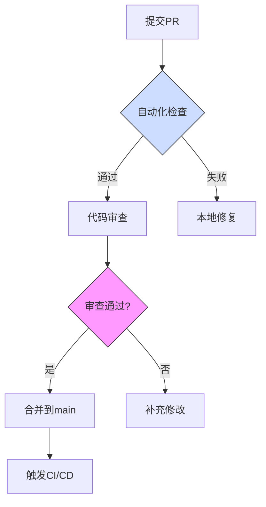

# Next.js 项目最佳实践指南

在现代前端开发中，采用最佳实践对于构建高质量、可维护和高性能的应用至关重要。本文将分享基于 Next.js 和 React 技术栈的全面最佳实践指南，帮助开发团队提升代码质量和开发效率。

## 代码组织与架构

良好的代码组织是项目可维护性的基础。在 Next.js 项目中，我们推荐以下架构模式：

### 组件分层

将组件明确分为三个层次：

1. **原子组件**：最小的 UI 单元，如按钮、输入框
2. **分子组件**：由多个原子组件组成的功能单元
3. **有机体组件**：完整的功能模块，如表单、卡片列表

```tsx
// 原子组件示例
function Button({ children, ...props }) {
  return <button className="btn" {...props}>{children}</button>;
}

// 分子组件示例
function SearchInput({ onSearch }) {
  return (
    <div className="search-container">
      <Input placeholder="搜索..." />
      <Button onClick={onSearch}>搜索</Button>
    </div>
  );
}
```

### Feature-First 架构

按功能而非类型组织代码，将相关的组件、hooks 和工具函数放在同一目录下：

```
src/
  features/
    auth/
      components/
      hooks/
      utils/
      types.ts
    dashboard/
      components/
      hooks/
      utils/
      types.ts
```

### 组件文档

为每个组件添加详细的 JSDoc 注释，说明其用途、属性和使用示例：

```tsx
/**
 * @component Button
 * @description 通用按钮组件，支持多种变体和大小
 * @example
 * <Button variant="primary" size="md">点击我</Button>
 *
 * @param {Object} props - 组件属性
 * @param {'primary'|'secondary'|'outline'} [props.variant='primary'] - 按钮样式变体
 * @param {'sm'|'md'|'lg'} [props.size='md'] - 按钮大小
 * @param {ReactNode} props.children - 按钮内容
 */
```

## 性能优化策略

Next.js 提供了许多性能优化工具，但需要正确使用才能发挥最大效果。

### 代码分割与懒加载

使用动态导入延迟加载非关键组件：

```tsx
// 动态导入重量级组件
const DynamicChart = dynamic(() => import('@/components/Chart'), {
  loading: () => <Skeleton height={300} />,
  ssr: false // 如果组件不需要服务器渲染
});
```

### 图片优化

使用 Next.js Image 组件优化图片加载：

```tsx
<Image
  src="/profile.jpg"
  alt="用户头像"
  width={64}
  height={64}
  placeholder="blur"
  blurDataURL="data:image/jpeg;base64,..."
  priority={isAboveTheFold}
/>
```

### React 优化技术

合理使用 React 的优化 API：

```tsx
// 使用 memo 避免不必要的重渲染
const MemoizedComponent = React.memo(ExpensiveComponent);

// 使用 useMemo 缓存计算结果
const sortedItems = useMemo(() => {
  return [...items].sort((a, b) => a.name.localeCompare(b.name));
}, [items]);

// 使用 useCallback 缓存函数引用
const handleSubmit = useCallback(() => {
  // 处理提交逻辑
}, [dependencies]);
```

### Suspense 和错误边界

使用 Suspense 和错误边界改善用户体验：

```tsx
<ErrorBoundary fallback={<ErrorMessage />}>
  <Suspense fallback={<Loading />}>
    <UserProfile />
  </Suspense>
</ErrorBoundary>
```

## 状态管理最佳实践

选择合适的状态管理方案对应用性能和可维护性至关重要。

### 本地状态管理

对于简单组件，使用 React 内置的状态管理：

```tsx
// 使用 useState 管理简单状态
const [count, setCount] = useState(0);

// 使用 useReducer 管理复杂状态
const [state, dispatch] = useReducer(reducer, initialState);
```

### 全局状态管理

对于跨组件共享的状态，推荐使用 Zustand：

```tsx
// 创建全局状态
import create from 'zustand';

export const useStore = create((set) => ({
  user: null,
  isAuthenticated: false,
  login: (userData) => set({ user: userData, isAuthenticated: true }),
  logout: () => set({ user: null, isAuthenticated: false }),
}));

// 在组件中使用
function Profile() {
  const { user, logout } = useStore();
  // ...
}
```

### 服务器状态管理

使用 React Query 管理服务器数据：

```tsx
// 获取用户数据
const { data, isLoading, error } = useQuery(
  ['user', userId],
  () => fetchUser(userId),
  {
    staleTime: 5 * 60 * 1000, // 5分钟
    cacheTime: 30 * 60 * 1000, // 30分钟
    retry: 3,
  }
);
```

## 样式与设计系统

一致的设计系统是良好用户体验的基础。

### Tailwind CSS 最佳实践

使用 Tailwind CSS 时的最佳实践：

```tsx
// 使用组合类名而非内联样式
<div className="flex items-center justify-between p-4 bg-white rounded-lg shadow-sm">
  {/* 内容 */}
</div>

// 使用 @apply 抽取重复的类组合
// styles.css
.card {
  @apply p-4 bg-white rounded-lg shadow-sm;
}
```

### 组件变体系统

使用 class-variance-authority 创建组件变体：

```tsx
import { cva } from 'class-variance-authority';

const buttonVariants = cva(
  'inline-flex items-center justify-center rounded-md text-sm font-medium transition-colors',
  {
    variants: {
      variant: {
        default: 'bg-primary text-primary-foreground hover:bg-primary/90',
        destructive: 'bg-destructive text-destructive-foreground hover:bg-destructive/90',
        outline: 'border border-input bg-background hover:bg-accent hover:text-accent-foreground',
      },
      size: {
        default: 'h-10 py-2 px-4',
        sm: 'h-9 px-3',
        lg: 'h-11 px-8',
      },
    },
    defaultVariants: {
      variant: 'default',
      size: 'default',
    },
  }
);

export function Button({ variant, size, ...props }) {
  return <button className={buttonVariants({ variant, size })} {...props} />;
}
```

### 主题系统

使用 CSS 变量和 Tailwind 实现主题切换：

```tsx
// tailwind.config.js
module.exports = {
  theme: {
    extend: {
      colors: {
        primary: 'var(--color-primary)',
        secondary: 'var(--color-secondary)',
        // 更多颜色...
      },
    },
  },
};

// globals.css
:root {
  --color-primary: #3b82f6;
  --color-secondary: #10b981;
}

[data-theme="dark"] {
  --color-primary: #60a5fa;
  --color-secondary: #34d399;
}
```

## 可访问性 (A11y)

可访问性不仅是法律要求，也是良好用户体验的基础。

### 语义化 HTML

使用正确的 HTML 元素表达内容的语义：

```tsx
// 不好的做法
<div onClick={handleClick}>点击我</div>

// 好的做法
<button onClick={handleClick}>点击我</button>
```

### ARIA 属性

为非标准交互元素添加 ARIA 属性：

```tsx
<div
  role="button"
  aria-pressed={isActive}
  aria-label="展开菜单"
  tabIndex={0}
  onClick={handleClick}
  onKeyDown={handleKeyDown}
>
  <MenuIcon />
</div>
```

### 键盘导航

确保所有交互都可以通过键盘完成：

```tsx
function handleKeyDown(event) {
  if (event.key === 'Enter' || event.key === ' ') {
    handleClick();
  }
}
```

### 焦点管理

在模态框和弹出菜单中管理焦点：

```tsx
function Modal({ isOpen, onClose, children }) {
  const modalRef = useRef(null);

  useEffect(() => {
    if (isOpen) {
      // 打开时捕获焦点
      modalRef.current?.focus();

      // 捕获并限制 Tab 键
      const handleKeyDown = (e) => {
        if (e.key === 'Tab') {
          // 实现焦点陷阱
        }
      };

      document.addEventListener('keydown', handleKeyDown);
      return () => document.removeEventListener('keydown', handleKeyDown);
    }
  }, [isOpen]);

  return isOpen ? (
    <div
      ref={modalRef}
      role="dialog"
      aria-modal="true"
      tabIndex={-1}
    >
      {children}
      <button onClick={onClose}>关闭</button>
    </div>
  ) : null;
}
```

## 测试策略

全面的测试策略是保证代码质量的关键。

### 单元测试

使用 React Testing Library 测试组件：

```tsx
import { render, screen, fireEvent } from '@testing-library/react';
import { Button } from './Button';

test('按钮点击时调用 onClick 处理程序', () => {
  const handleClick = jest.fn();
  render(<Button onClick={handleClick}>点击我</Button>);

  fireEvent.click(screen.getByText('点击我'));

  expect(handleClick).toHaveBeenCalledTimes(1);
});
```

### 集成测试

测试组件之间的交互：

```tsx
test('提交表单后显示成功消息', async () => {
  render(<ContactForm />);

  fireEvent.change(screen.getByLabelText('姓名'), {
    target: { value: '张三' },
  });

  fireEvent.change(screen.getByLabelText('邮箱'), {
    target: { value: 'zhangsan@example.com' },
  });

  fireEvent.click(screen.getByText('提交'));

  expect(await screen.findByText('提交成功')).toBeInTheDocument();
});
```

### 端到端测试

使用 Playwright 进行端到端测试：

```js
test('用户可以登录并访问仪表板', async ({ page }) => {
  await page.goto('/login');

  await page.fill('input[name="email"]', 'user@example.com');
  await page.fill('input[name="password"]', 'password123');
  await page.click('button[type="submit"]');

  await page.waitForURL('/dashboard');
  expect(await page.textContent('h1')).toContain('欢迎回来');
});
```

## 国际化 (i18n)

支持多语言是扩大应用受众的有效方式。

### 使用 next-intl

```tsx
// messages/zh.json
{
  "Home": {
    "title": "欢迎来到我们的网站",
    "description": "这是一个示例网站"
  }
}

// messages/en.json
{
  "Home": {
    "title": "Welcome to our website",
    "description": "This is a sample website"
  }
}

// 在组件中使用
import { useTranslations } from 'next-intl';

function HomePage() {
  const t = useTranslations('Home');

  return (
    <div>
      <h1>{t('title')}</h1>
      <p>{t('description')}</p>
    </div>
  );
}
```

## SEO 优化

良好的 SEO 是提高网站可见性的关键。

### 使用 Next.js Metadata API

```tsx
// layout.tsx 或 page.tsx
export const metadata = {
  title: '文章标题',
  description: '文章描述',
  openGraph: {
    title: '文章标题',
    description: '文章描述',
    images: ['/og-image.jpg'],
  },
  twitter: {
    card: 'summary_large_image',
    title: '文章标题',
    description: '文章描述',
    images: ['/twitter-image.jpg'],
  },
};
```

### 结构化数据

添加 JSON-LD 结构化数据：

```tsx
function BlogPost({ post }) {
  return (
    <>
      <script
        type="application/ld+json"
        dangerouslySetInnerHTML={{
          __html: JSON.stringify({
            '@context': 'https://schema.org',
            '@type': 'BlogPosting',
            headline: post.title,
            datePublished: post.date,
            author: {
              '@type': 'Person',
              name: post.author,
            },
          }),
        }}
      />
      <article>{/* 文章内容 */}</article>
    </>
  );
}
```

## 错误处理与日志

全面的错误处理策略可以提高应用的稳定性和可调试性。

### 错误边界

创建全局错误边界捕获组件错误：

```tsx
class ErrorBoundary extends React.Component {
  constructor(props) {
    super(props);
    this.state = { hasError: false };
  }

  static getDerivedStateFromError(error) {
    return { hasError: true };
  }

  componentDidCatch(error, errorInfo) {
    // 发送错误到日志服务
    logError(error, errorInfo);
  }

  render() {
    if (this.state.hasError) {
      return this.props.fallback || <div>出错了，请刷新页面</div>;
    }

    return this.props.children;
  }
}
```

### API 错误处理

统一处理 API 错误：

```tsx
async function fetchWithErrorHandling(url, options = {}) {
  try {
    const response = await fetch(url, options);

    if (!response.ok) {
      const errorData = await response.json().catch(() => ({}));
      throw new ApiError(response.status, errorData.message || '请求失败');
    }

    return await response.json();
  } catch (error) {
    // 处理网络错误
    if (error.name === 'AbortError') {
      throw new ApiError(0, '请求被取消');
    }

    if (!(error instanceof ApiError)) {
      throw new ApiError(0, '网络错误');
    }

    throw error;
  }
}
```

## 安全性

安全性是应用开发中不可忽视的方面。

### 内容安全策略 (CSP)

在 `next.config.js` 中添加 CSP 头：

```js
const securityHeaders = [
  {
    key: 'Content-Security-Policy',
    value: "default-src 'self'; script-src 'self' 'unsafe-eval'; style-src 'self' 'unsafe-inline';"
  },
  {
    key: 'X-XSS-Protection',
    value: '1; mode=block'
  },
  // 其他安全头...
];

module.exports = {
  async headers() {
    return [
      {
        source: '/:path*',
        headers: securityHeaders,
      },
    ];
  },
};
```

### 输入验证

使用 Zod 验证用户输入：

```tsx
import { z } from 'zod';

const contactSchema = z.object({
  name: z.string().min(2, '姓名至少需要2个字符'),
  email: z.string().email('请输入有效的邮箱地址'),
  message: z.string().min(10, '消息至少需要10个字符'),
});

function ContactForm() {
  const handleSubmit = (data) => {
    try {
      const validated = contactSchema.parse(data);
      // 处理验证通过的数据
    } catch (error) {
      // 处理验证错误
    }
  };

  // 表单实现...
}
```

## 代码质量管理

### 代码审查流程



### 审查标准

1. **架构规范**：
   - 符合SOLID原则
   - 模块依赖关系合理

2. **代码异味检测**：
   ```bash
   # 使用ESLint进行静态检测
   pnpm run lint --fix

   # 检测测试覆盖率
   pnpm test --coverage
   ```

3. **安全审查**：
   - 使用OWASP ZAP进行漏洞扫描
   - 依赖项审计：`pnpm audit`

## 总结

采用这些最佳实践可以帮助团队构建高质量、可维护和高性能的 Next.js 应用。记住，最佳实践应该根据项目的具体需求和团队的技能水平进行调整。定期回顾和更新这些实践，确保它们与技术发展和项目需求保持一致。

通过持续学习和改进，我们可以不断提高代码质量和开发效率，为用户提供更好的体验。
