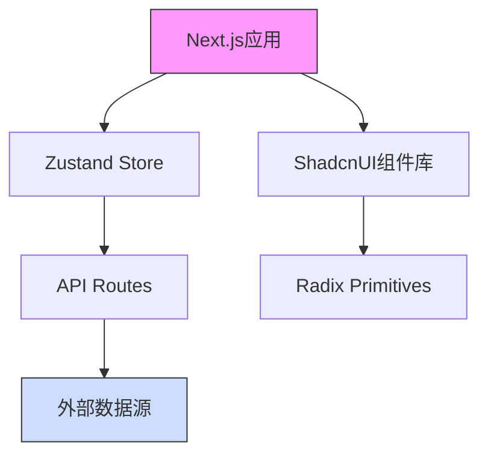

## 项目介绍

本站为 “iFluxArt · 斐流艺创” 官方网站。

### 名称诠释

#### 英文名

“iFluxArt” 由三个单词组成，也是网站的核心要素：

- Intelligence （智能） - 代表人工智能技术驱动
- Flux （流动） - 象征创意与技术的动态融合
- Art （艺术） - 体现数字艺术创作本质

#### 中文名

”斐流艺创“ 既是 “iFluxArt” 的中文翻译，亦是智能技术与艺术创作的有机融合，代表 ”斐然成章“ 的创作力与 “川流不息” 的技术流。

### 技术栈

本站使用以下技术栈：

- 前端框架：[Next.js](https://nextjs.org/) - 用于构建高性能的 React 应用
- 状态管理：[Zustand](https://github.com/pmndrs/zustand) - 简单而灵活的状态管理库
- 样式：[TailwindCSS](https://tailwindcss.com/) - 实用优先的 CSS 框架
- 组件库：[Radix UI](https://www.radix-ui.com/) 和 [ShadcnUI](https://ui.shadcn.com/) - 提供可访问的 UI 组件
- 图标：[lucide-react](https://lucide.dev/) - 统一的图标风格
- 动画：[Framer Motion](https://www.framer.com/motion/) - 用于创建动画效果
- 测试框架：[Jest](https://jestjs.io/) 和 [React Testing Library](https://testing-library.com/docs/react-testing-library/intro/) - 用于单元测试和组件测试
- 构建工具：[Turborepo](https://turborepo.org/) - 适用于 Monorepo 的构建工具
- 部署工具：[Vercel](https://vercel.com/) - 用于部署静态网站和服务器端渲染应用
- 包管理器：[pnpm](https://pnpm.io/) - 用于管理依赖项的包管理器

### 系统架构



### 部署流程

1. **持续集成配置**
   - Vercel自动部署main分支
   - 预发布环境部署到preview分支
   - 设置自动HTTPS与CDN缓存

2. **环境变量管理**
   ```bash
   # .env.production
   NEXT_PUBLIC_GA_ID=G-XXXXXXX
   NEXT_PUBLIC_SENTRY_DSN=xxxx
   ```

3. **性能监控**
   - 集成Lighthouse CI
   - 部署后自动生成性能报告
   - 设置核心Web指标报警阈值