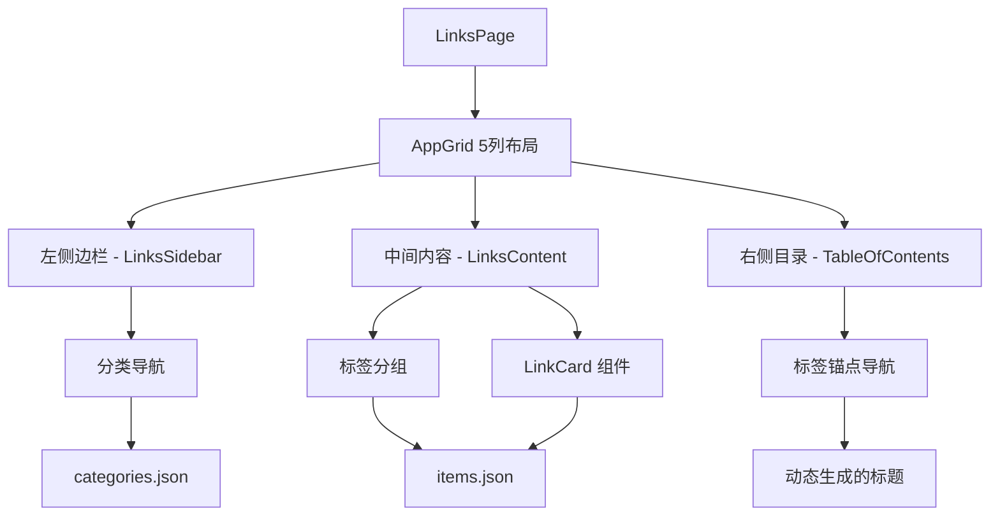
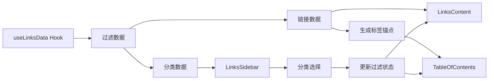

# 设计文档

## 概述

本设计文档详细描述了链接导航页面重构的技术实现方案。重构后的页面将采用与文档页面相同的三栏布局，提供更好的用户体验和导航功能。设计重点关注组件复用、性能优化和用户交互体验。

## 架构

### 整体架构



### 数据流架构



## 组件和接口

### 1. 主页面组件 (LinksPage)

**职责：** 作为页面的主容器，管理整体布局和数据流

**接口：**

```typescript
interface LinksPageProps {
  // 无需外部 props，使用内部 hooks 管理状态
}
```

**主要功能：**

- 使用 `useLinksData` hook 获取和管理数据
- 实现三栏布局结构
- 协调各子组件的数据传递

### 2. 链接侧边栏组件 (LinksSidebar)

**职责：** 显示分类导航，支持分类筛选功能

**接口：**

```typescript
interface LinksSidebarProps {
  categories: LinksCategory[];
  selectedCategory?: string;
  onCategoryChange: (categoryId: string) => void;
  className?: string;
}

interface LinksCategory {
  id: string;
  name: string;
  description: string;
  order: number;
}
```

**设计特点：**

- 复用文档侧边栏的样式和交互模式
- 支持分类的展开/折叠状态管理
- 高亮显示当前选中的分类
- 响应式设计，在小屏幕上隐藏

### 3. 链接内容组件 (LinksContent)

**职责：** 显示按标签分组的链接卡片

**接口：**

```typescript
interface LinksContentProps {
  items: LinksItem[];
  selectedCategory?: string;
  className?: string;
}

interface LinksItem {
  id: string;
  title: string;
  description?: string;
  url: string;
  category: string;
  tags: string[];
  icon?: string;
  iconType?: "image" | "text";
  featured?: boolean;
}
```

**设计特点：**

- 按标签对链接进行分组显示
- 为每个标签分组生成 h2 标题和锚点
- 使用现有的 LinkCard 组件展示链接
- 支持网格布局的响应式调整

### 4. 标签锚点生成器 (useTagAnchors)

**职责：** 生成标签锚点数据供 TableOfContents 使用

**接口：**

```typescript
interface TagAnchor {
  id: string;
  text: string;
  level: number;
}

function useTagAnchors(items: LinksItem[]): TagAnchor[];
```

**设计特点：**

- 从链接数据中提取唯一标签
- 生成符合 TableOfContents 要求的锚点数据
- 支持标签的排序和去重

## 数据模型

### 分类数据结构

```typescript
interface LinksCategory {
  id: string; // 分类唯一标识
  name: string; // 分类显示名称
  description: string; // 分类描述
  order: number; // 排序权重
}
```

### 链接数据结构

```typescript
interface LinksItem {
  id: string; // 链接唯一标识
  title: string; // 链接标题
  description?: string; // 链接描述
  url: string; // 链接地址
  category: string; // 所属分类ID
  tags: string[]; // 标签数组
  icon?: string; // 图标URL或文本
  iconType?: "image" | "text"; // 图标类型
  featured?: boolean; // 是否为推荐链接
  createdAt: string; // 创建时间
  updatedAt: string; // 更新时间
}
```

### 标签锚点数据结构

```typescript
interface TagAnchor {
  id: string; // 锚点ID，格式：tag-{标签名}
  text: string; // 显示文本（标签名）
  level: number; // 标题级别，固定为2
}
```

## 错误处理

### 数据加载错误

**策略：**

1. 使用 `useLinksData` hook 的内置错误处理
2. 显示友好的错误提示信息
3. 提供重试机制或降级显示

**实现：**

```typescript
if (error) {
  return (
    <div className="container mx-auto py-8">
      <div className="text-center">
        <h1 className="text-2xl font-bold text-destructive mb-4">
          加载失败
        </h1>
        <p className="text-muted-foreground mb-4">{error}</p>
        <button onClick={retry} className="btn-primary">
          重试
        </button>
      </div>
    </div>
  );
}
```

### 数据为空处理

**策略：**

1. 检查数据是否为空或无效
2. 显示空状态提示
3. 提供相关操作建议

### 图标加载失败处理

**策略：**

1. LinkCard 组件已内置图标失败处理
2. 自动降级显示标题首字符
3. 保持界面一致性

## 测试策略

### 单元测试

**测试范围：**

1. `useTagAnchors` hook 的数据转换逻辑
2. `LinksSidebar` 的分类筛选功能
3. `LinksContent` 的标签分组逻辑
4. 数据过滤功能（排除友链和个人主页）

**测试用例：**

```typescript
describe('useTagAnchors', () => {
  it('should generate unique tag anchors', () => {
    const items = [
      { tags: ['前端', '工具'], ... },
      { tags: ['前端', '框架'], ... }
    ];
    const anchors = useTagAnchors(items);
    expect(anchors).toHaveLength(3); // 前端、工具、框架
  });
});
```

### 集成测试

**测试范围：**

1. 页面整体布局渲染
2. 分类筛选与内容联动
3. 锚点导航功能
4. 响应式布局适配

### 用户体验测试

**测试重点：**

1. 页面加载性能
2. 交互响应速度
3. 移动端适配效果
4. 无障碍访问支持

## 性能优化

### 数据处理优化

**策略：**

1. 使用 `useMemo` 缓存计算结果
2. 避免不必要的数据重新计算
3. 优化标签分组算法

**实现：**

```typescript
const groupedItems = useMemo(() => {
  return groupItemsByTags(filteredItems);
}, [filteredItems]);

const tagAnchors = useMemo(() => {
  return generateTagAnchors(groupedItems);
}, [groupedItems]);
```

### 渲染优化

**策略：**

1. 使用 `React.memo` 优化组件重渲染
2. 合理使用 `useCallback` 缓存事件处理函数
3. 避免内联对象和函数创建

### 图片加载优化

**策略：**

1. 使用 Next.js Image 组件的懒加载
2. 设置合适的图片尺寸和格式
3. 实现图片加载失败的优雅降级

## 可访问性设计

### 键盘导航

**支持：**

1. Tab 键在侧边栏分类间导航
2. Enter/Space 键选择分类
3. 锚点链接支持键盘访问

### 屏幕阅读器

**优化：**

1. 为分类按钮添加 `aria-label`
2. 为锚点链接提供描述性文本
3. 使用语义化的 HTML 结构

### 颜色对比度

**要求：**

1. 确保文本与背景的对比度符合 WCAG 标准
2. 选中状态有明显的视觉反馈
3. 支持高对比度模式

## 兼容性考虑

### 浏览器兼容性

**支持范围：**

- Chrome 90+
- Firefox 88+
- Safari 14+
- Edge 90+

### 移动端适配

**策略：**

1. 在小屏幕上隐藏侧边栏和右侧目录
2. 中间内容区占满全宽
3. 保持链接卡片的响应式布局

### 降级方案

**无 JavaScript 环境：**

1. 显示所有链接内容
2. 保持基本的样式和布局
3. 锚点链接仍可正常工作
