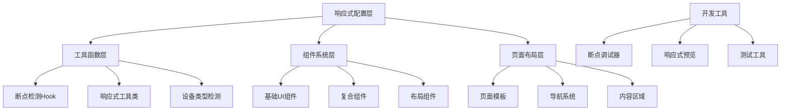

# 响应式设计系统设计文档

## Overview

本设计文档基于项目的技术栈（Next.js 15 + Tailwind CSS 4 + TypeScript + Radix UI），为整个应用建立一套完整的响应式设计系统。该系统将提供统一的断点标准、组件适配规范、开发工具和测试方案，确保在移动端、平板端、PC端和大屏版四种设备上的最佳用户体验。

## Architecture

### 技术栈分析
- **Next.js 15**: 支持最新的React 19特性，提供优秀的SSR和图片优化
- **Tailwind CSS 4**: 新版本提供更好的性能和开发体验
- **TypeScript**: 提供类型安全的开发环境
- **Radix UI**: 无样式的可访问性组件库
- **Class Variance Authority (CVA)**: 组件变体管理

### 系统架构设计



## Components and Interfaces

### 1. 响应式配置系统

#### 断点配置 (`src/config/responsive.ts`)
```typescript
export const BREAKPOINTS = {
  mobile: { min: 0, max: 768 },
  tablet: { min: 769, max: 1024 },
  desktop: { min: 1025, max: 1440 },
  large: { min: 1441, max: Infinity }
} as const;

export const DEVICE_QUERIES = {
  mobile: '(max-width: 768px)',
  tablet: '(min-width: 769px) and (max-width: 1024px)',
  desktop: '(min-width: 1025px) and (max-width: 1440px)',
  large: '(min-width: 1441px)',
  touch: '(hover: none) and (pointer: coarse)',
  mouse: '(hover: hover) and (pointer: fine)'
} as const;
```

#### Tailwind配置扩展
```javascript
// tailwind.config.mjs 扩展
const responsiveConfig = {
  screens: {
    'mobile': { 'max': '768px' },
    'tablet': { 'min': '769px', 'max': '1024px' },
    'desktop': { 'min': '1025px', 'max': '1440px' },
    'large': { 'min': '1441px' },
    'touch': { 'raw': '(hover: none) and (pointer: coarse)' },
    'mouse': { 'raw': '(hover: hover) and (pointer: fine)' }
  },
  spacing: {
    // 响应式间距系统
    'mobile-xs': '0.5rem',   // 8px
    'mobile-sm': '0.75rem',  // 12px
    'mobile-md': '1rem',     // 16px
    'mobile-lg': '1.5rem',   // 24px
    'mobile-xl': '2rem',     // 32px
    
    'tablet-xs': '0.75rem',  // 12px
    'tablet-sm': '1rem',     // 16px
    'tablet-md': '1.5rem',   // 24px
    'tablet-lg': '2rem',     // 32px
    'tablet-xl': '3rem',     // 48px
    
    'desktop-xs': '1rem',    // 16px
    'desktop-sm': '1.5rem',  // 24px
    'desktop-md': '2rem',    // 32px
    'desktop-lg': '3rem',    // 48px
    'desktop-xl': '4rem',    // 64px
    
    'large-xs': '1.5rem',    // 24px
    'large-sm': '2rem',      // 32px
    'large-md': '3rem',      // 48px
    'large-lg': '4rem',      // 64px
    'large-xl': '6rem'       // 96px
  }
};
```

### 2. React Hooks系统

#### 设备检测Hook (`src/hooks/use-device.ts`)
```typescript
export interface DeviceInfo {
  type: 'mobile' | 'tablet' | 'desktop' | 'large';
  isMobile: boolean;
  isTablet: boolean;
  isDesktop: boolean;
  isLarge: boolean;
  isTouch: boolean;
  isMouse: boolean;
  width: number;
  height: number;
}

export function useDevice(): DeviceInfo;
export function useBreakpoint(): string;
export function useMediaQuery(query: string): boolean;
```

#### 响应式状态Hook (`src/hooks/use-responsive.ts`)
```typescript
export function useResponsiveValue<T>(values: {
  mobile?: T;
  tablet?: T;
  desktop?: T;
  large?: T;
  default: T;
}): T;

export function useResponsiveState<T>(
  initialValues: ResponsiveValues<T>
): [T, (value: T | ResponsiveValues<T>) => void];
```

### 3. 组件系统改造

#### 基础组件接口
```typescript
interface ResponsiveComponentProps {
  responsive?: {
    mobile?: ComponentVariant;
    tablet?: ComponentVariant;
    desktop?: ComponentVariant;
    large?: ComponentVariant;
  };
  className?: string;
}

interface TouchOptimizedProps {
  touchTarget?: 'small' | 'medium' | 'large'; // 44px, 48px, 56px
  hoverEffects?: boolean; // 自动检测是否显示hover效果
}
```

#### 响应式Button组件
```typescript
const responsiveButtonVariants = cva(
  // 基础样式保持不变
  "inline-flex items-center justify-center gap-2 whitespace-nowrap rounded-md text-sm font-medium transition-all disabled:pointer-events-none disabled:opacity-50",
  {
    variants: {
      size: {
        default: "h-9 px-4 py-2 mobile:h-11 mobile:px-6 mobile:py-3",
        sm: "h-8 px-3 mobile:h-10 mobile:px-4",
        lg: "h-10 px-6 mobile:h-12 mobile:px-8",
        icon: "size-9 mobile:size-11"
      },
      touchTarget: {
        small: "min-h-[44px] min-w-[44px]",
        medium: "min-h-[48px] min-w-[48px]", 
        large: "min-h-[56px] min-w-[56px]"
      }
    }
  }
);
```

#### 响应式Card组件
```typescript
const responsiveCardVariants = cva(
  "flex flex-col rounded-xl border bg-card text-card-foreground shadow-sm",
  {
    variants: {
      spacing: {
        default: "gap-4 p-4 tablet:gap-6 tablet:p-6 desktop:gap-8 desktop:p-8",
        compact: "gap-2 p-3 tablet:gap-4 tablet:p-4 desktop:gap-6 desktop:p-6",
        loose: "gap-6 p-6 tablet:gap-8 tablet:p-8 desktop:gap-12 desktop:p-12"
      }
    }
  }
);
```

### 4. 布局系统

#### 响应式容器组件
```typescript
interface ResponsiveContainerProps {
  maxWidth?: 'mobile' | 'tablet' | 'desktop' | 'large' | 'full';
  padding?: 'none' | 'sm' | 'md' | 'lg' | 'responsive';
  children: React.ReactNode;
}

const containerVariants = cva("mx-auto w-full", {
  variants: {
    maxWidth: {
      mobile: "max-w-sm",
      tablet: "max-w-2xl", 
      desktop: "max-w-6xl",
      large: "max-w-7xl",
      full: "max-w-none"
    },
    padding: {
      none: "",
      sm: "px-4",
      md: "px-6",
      lg: "px-8",
      responsive: "px-4 tablet:px-6 desktop:px-8 large:px-12"
    }
  }
});
```

#### 响应式网格系统
```typescript
interface ResponsiveGridProps {
  cols?: {
    mobile?: number;
    tablet?: number;
    desktop?: number;
    large?: number;
  };
  gap?: 'sm' | 'md' | 'lg' | 'responsive';
  children: React.ReactNode;
}

const gridVariants = cva("grid", {
  variants: {
    gap: {
      sm: "gap-2",
      md: "gap-4", 
      lg: "gap-6",
      responsive: "gap-3 tablet:gap-4 desktop:gap-6 large:gap-8"
    }
  }
});
```

### 5. 导航系统改造

#### 响应式导航栏
- **移动端**: 汉堡菜单 + 底部导航栏（可选）
- **平板端**: 折叠式菜单 + 主要操作按钮
- **PC端**: 完整水平菜单
- **大屏版**: 扩展菜单 + 额外功能区域

#### 导航组件接口
```typescript
interface ResponsiveNavProps {
  variant?: 'mobile' | 'tablet' | 'desktop' | 'large' | 'auto';
  showBottomNav?: boolean; // 移动端底部导航
  collapsible?: boolean;   // 是否可折叠
  items: NavItem[];
}
```

## Data Models

### 响应式配置数据模型

```typescript
interface ResponsiveConfig {
  breakpoints: Record<DeviceType, BreakpointConfig>;
  spacing: Record<DeviceType, SpacingConfig>;
  typography: Record<DeviceType, TypographyConfig>;
  components: Record<string, ComponentResponsiveConfig>;
}

interface BreakpointConfig {
  min: number;
  max: number;
  mediaQuery: string;
}

interface SpacingConfig {
  xs: string;
  sm: string;
  md: string;
  lg: string;
  xl: string;
}

interface TypographyConfig {
  fontSize: Record<string, string>;
  lineHeight: Record<string, string>;
  letterSpacing: Record<string, string>;
}

interface ComponentResponsiveConfig {
  variants: Record<string, ResponsiveVariant>;
  defaultProps: Record<DeviceType, any>;
}
```

### 设备信息数据模型

```typescript
interface DeviceState {
  currentDevice: DeviceType;
  viewport: {
    width: number;
    height: number;
  };
  capabilities: {
    touch: boolean;
    hover: boolean;
    orientation: 'portrait' | 'landscape';
  };
  preferences: {
    reducedMotion: boolean;
    highContrast: boolean;
  };
}
```

## Error Handling

### 1. 断点检测错误处理
- **服务端渲染兼容**: 提供默认值避免hydration不匹配
- **媒体查询不支持**: 降级到基础样式
- **JavaScript禁用**: 确保CSS-only的响应式功能

### 2. 组件渲染错误处理
- **Props验证**: TypeScript类型检查 + 运行时验证
- **样式回退**: 提供安全的默认样式
- **性能监控**: 检测响应式切换的性能影响

### 3. 开发时错误处理
```typescript
// 开发环境下的断点调试
if (process.env.NODE_ENV === 'development') {
  // 显示当前断点信息
  // 验证响应式配置
  // 性能警告
}
```

## Testing Strategy

### 1. 单元测试
- **Hook测试**: 使用`@testing-library/react-hooks`测试响应式hooks
- **组件测试**: 测试不同断点下的组件渲染
- **工具函数测试**: 测试断点检测和媒体查询函数

### 2. 集成测试
- **页面级测试**: 使用Playwright测试不同视口尺寸
- **交互测试**: 测试触摸和鼠标交互的差异
- **导航测试**: 测试响应式导航的功能

### 3. 视觉回归测试
- **截图对比**: 使用Chromatic或类似工具
- **多设备测试**: 自动化测试不同设备尺寸
- **主题兼容**: 测试明暗主题下的响应式效果

### 4. 性能测试
- **Bundle大小**: 监控响应式系统对包大小的影响
- **运行时性能**: 测试媒体查询监听的性能
- **首屏渲染**: 确保响应式不影响LCP指标

### 5. 可访问性测试
- **键盘导航**: 测试不同设备上的键盘访问
- **屏幕阅读器**: 确保响应式布局的语义正确
- **触摸目标**: 验证触摸目标大小符合WCAG标准

## Implementation Phases

### Phase 1: 基础设施搭建
1. 配置文件和类型定义
2. 基础hooks和工具函数
3. Tailwind配置扩展

### Phase 2: 组件系统改造
1. 基础UI组件响应式改造
2. 布局组件开发
3. 导航系统重构

### Phase 3: 页面级适配
1. 现有页面响应式改造
2. 新页面模板开发
3. 内容适配优化

### Phase 4: 工具和测试
1. 开发工具开发
2. 测试套件建立
3. 文档和示例

## Performance Considerations

### 1. CSS优化
- **Critical CSS**: 优先加载当前设备的样式
- **媒体查询优化**: 减少不必要的媒体查询
- **样式去重**: 避免重复的响应式样式

### 2. JavaScript优化
- **懒加载**: 按需加载设备特定的功能
- **防抖处理**: 优化resize事件监听
- **内存管理**: 及时清理事件监听器

### 3. 图片优化
- **响应式图片**: 使用Next.js Image组件的响应式功能
- **设备像素比**: 支持高DPI设备
- **格式选择**: 根据设备能力选择最优格式

## Migration Strategy

### 1. 渐进式迁移
- **新功能优先**: 新开发的功能使用新的响应式系统
- **关键页面**: 优先改造首页和主要功能页面
- **组件级迁移**: 逐个组件进行响应式改造

### 2. 兼容性保证
- **向后兼容**: 确保现有功能不受影响
- **样式隔离**: 新旧样式系统共存
- **渐进增强**: 基础功能在所有设备上可用

### 3. 验证和回滚
- **A/B测试**: 对比新旧系统的用户体验
- **监控指标**: 关注性能和用户行为指标
- **快速回滚**: 准备回滚方案应对问题