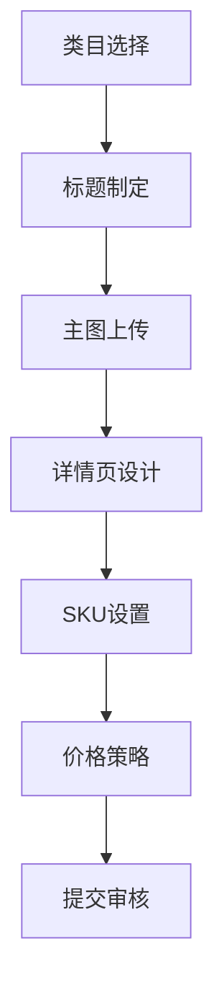

> 抖店运营：从入驻到提升的全方位指南

## 核心运营模块

### 入驻条件

- 完成店铺入驻及保证金缴纳（具体参考[招商标准](https://school.jinritemai.com/doudian/web/article/101818)）
- 绑定店铺官方账号（路径：店铺 > 店铺官方账号）
- 企业资质审核（营业执照、法人身份证等）
- 类目资质认证（根据经营类目提交相应证明）

### 店铺装修

#### 设计规范

1. 首屏展示核心营销活动
2. 商品分类导航不超过3级
3. 主图尺寸建议750x750px
4. 视频封面与商品关联度≥80%

#### 工具集成

- 优惠券弹窗配置
- 客服悬浮窗位置优化
- 智能推荐算法接入

### 商家体验分

| 指标类型 | 考核周期 | 权重 | 达标值 |
| -------- | -------- | ---- | ------ |
| 商品体验 | 近30天   | 45%  | ≥4.8   |
| 物流体验 | 近30天   | 35%  | ≥4.7   |
| 服务体验 | 近30天   | 20%  | ≥4.9   |

### 商品发布

## 抖店店铺装修

### 装修的重要性

店铺装修是商家自主设计店铺页的关键途径，它不仅仅是美化店铺的手段，更是提升店铺竞争力的重要因素。一个精心设计且独具风格的店铺页，能给消费者留下良好的第一印象。在当今竞争激烈的电商环境中，第一印象往往决定了消费者对店铺的信任感，而信任感正是促成成交的关键。此外，通过店铺装修，商家还可以进行热销商品推荐、新品发布以及营销活动展示等，吸引更多消费者的关注。

### 装修要求

要打造一个成功的店铺页面，需要遵循一定的装修要求。在产品选择方面，要确保所展示的产品合适，符合目标客户群体的需求和喜好。页面布局要合理，让消费者能够轻松找到所需信息，提高购物体验。图片展示要清晰，无水印、无拼接，真实反映商品的外观和细节。同时，要结合营销节点，利用节假日等特殊时期进行针对性的装修和推广。营销工具也是不可或缺的，合理运用这些工具可以提高店铺的曝光度和销量。

### 装修教程

如果您对店铺装修不太熟悉，可以参考[店铺装修 - 基础入门实操](https://school.jinritemai.com/doudian/web/course-series/cHQcSkFd3AQ4/cHQcSkFd3AQ4lHQeKoywscRK)，该教程详细介绍了店铺装修的各个环节和操作方法，帮助您快速上手。

## 商家体验分

商家体验分是抖音平台基于商家近90天内的商品体验、物流体验及服务体验三个维度的数据综合计算得出的店铺综合评分。这个评分在平台上具有重要作用，它不仅会影响店铺在平台的曝光度，还会与平台的流量扶持、活动报名资格等权益挂钩。较高的商家体验分有助于提升店铺的竞争力，吸引更多的消费者。商家可以通过优化商品质量，确保商品符合消费者的期望；提升物流效率，让消费者更快收到商品；以及完善售后服务，及时解决消费者的问题等方式来提高商家体验分。

## 运营策略

### 流量获取

1. 直播带货排期策略
2. 短视频内容矩阵搭建
3. 搜索关键词优化（参考[标题优化SOP](https://bytedance.larkoffice.com/docx/doxcntj5XmCtMakiqa5lDsEZJpd)）

### 数据监控

- 实时看板：包括GMV、UV价值、ROI
- 异常预警：体验分波动>0.2自动提醒
- 竞品分析：TOP10商家数据对标

### 规范管理

1. 每日商品自检（9:00-10:00）
2. 每周客服话术更新
3. 每月物流服务商评估

商品信息的真实、准确和完整是吸引消费者的基础。商品标题需简洁明了，准确概括商品的核心属性和特点，让消费者一眼就能了解商品的主要信息。商品描述应详细介绍商品的规格、材质、使用方法、注意事项等信息，帮助消费者全面了解商品，减少售后纠纷。

#### 图片要求

图片是消费者了解商品的重要途径，因此图片应清晰、无水印、无拼接，能真实反映商品的外观和细节。主图数量建议为 5 - 8 张，且首张主图应突出商品主体，吸引消费者的注意力。图片尺寸应符合平台规定，避免拉伸变形，影响商品的展示效果。

#### 价格要求

商品价格应遵循市场规律，不得恶意抬高或压低价格。如果有促销活动，需明确标注原价和促销价，并遵守平台的促销规则，确保促销活动的公平性和合法性。

#### 分类要求

商品应准确选择所属分类，便于用户搜索和查找。错误的分类可能会误导用户，降低用户体验，同时也可能影响商品的曝光度和销量。

### 商品标题优化

商品标题的优化对于提高商品的搜索排名和曝光度至关重要。商家可以参考[商家开展商品标题优化sop（可对外）](https://bytedance.larkoffice.com/docx/doxcntj5XmCtMakiqa5lDsEZJpd)，该文档详细介绍了商品标题优化的方法和技巧，帮助商家制定更具吸引力的商品标题。

抖店运营是一个系统的工程，需要商家在入驻、装修、提升体验分以及商品优化等多个方面下功夫。只有做好每一个环节，才能在激烈的市场竞争中脱颖而出，实现店铺的长期稳定发展。
