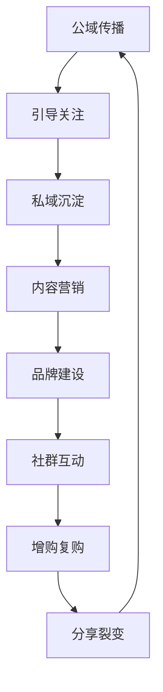

## 七大核心运营目标体系

### 1. 公域传播，获取关注

**实施方法：**
- 研究平台推荐算法，优化内容标签
- 参与热门话题和挑战
- 利用微信社交关系链进行传播

**关键指标：**
- 播放量
- 互动率(点赞/评论/分享)
- 完播率

### 2. 引导关注，私域沉淀

**转化路径设计：**
1. 视频内容中设置关注引导
2. 个人主页优化(头像、简介、封面)
3. 评论区互动引导关注

**私域工具：**
- 企业微信
- 微信群
- 公众号

### 3. 内容营销，直播带货

**内容策略：**
- 产品展示视频(30%)
- 使用场景视频(40%)
- 促销活动视频(30%)

**直播技巧：**
- 前3分钟是关键留存期
- 每15分钟设置一个互动点
- 使用优惠券刺激即时转化

### 4. 品牌建设，形象提升

**品牌三要素：**
1. 视觉识别(logo、色调、风格)
2. 内容调性(专业/亲民/幽默)
3. 价值观传达

**实施步骤：**
- 制定品牌手册
- 统一内容风格
- 定期品牌活动

### 5. 信息传递，社群互动

**社群运营矩阵：**
- 核心粉丝群(高价值用户)
- 普通用户群(广泛受众)
- 活动临时群(短期促销)

**互动策略：**
- 每日早安问候
- 每周主题讨论
- 每月福利活动

### 6. 增购复购，私域营销

**会员体系设计：**
- 成长等级
- 积分奖励
- 专属优惠

**复购刺激方法：**
- 老客户专属折扣
- 捆绑销售
- 限量发售

### 7. 分享裂变，营收增长

**裂变机制设计：**
- 邀请有礼
- 拼团活动
- 分享得积分

**关键点：**
- 设置合理的奖励机制
- 简化分享流程
- 追踪分享效果

## 运营闭环实施路线图

## 常见问题解决方案

1. **播放量低怎么办？**
   - 检查内容是否符合平台调性
   - 优化标题和封面
   - 调整发布时间

2. **转化率低怎么办？**
   - 检查产品与内容匹配度
   - 优化购买路径
   - 增加信任背书

3. **粉丝增长慢怎么办？**
   - 增加关注引导频次
   - 设置关注福利
   - 优化个人主页
