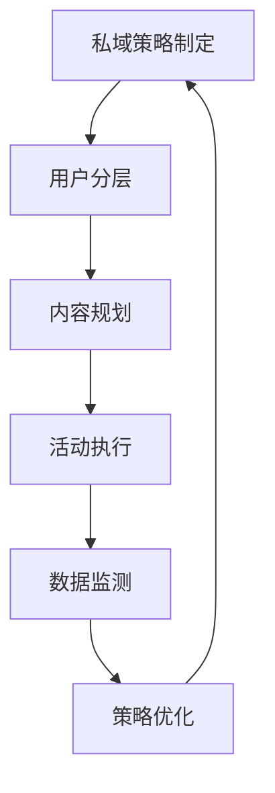

## 核心运营策略

### 用户生命周期管理
1. **引流阶段**：通过公域广告+裂变活动获取精准流量
2. **培育阶段**：分层推送行业报告/案例合集建立专业信任
3. **转化阶段**：限时福利+专属顾问促成首单转化
4. **裂变阶段**：老带新奖励机制设计（阶梯式奖励）

### 内容运营三板斧
- **专业内容**：每周行业白皮书解读
- **互动内容**：直播预约+评论区答疑
- **促销内容**：会员日专属福利预告

## 落地执行方案

### 运营节奏设计
1. **启动期（1-2周）**：种子用户招募+使用场景教育
2. **爆发期（3-4周）**：裂变活动+批量客户激活
3. **持续期（5+周）**：会员体系运营+复购激励

### 关键执行工具包
- 用户标签体系配置指南
- 自动化营销流程模板
- 客户成功案例库

### 效果评估维度
- 用户活跃度：7日回访率≥60%
- 转化效率：线索到成交周期≤14天
- 传播系数：老带新转化率≥35%

## 会员运营深度指南

### 会员体系搭建四步法
1. **会员等级设计**
   - 铜牌会员：消费满500元
   - 银牌会员：消费满2000元
   - 金牌会员：消费满5000元
   - 示例：某美妆品牌设置成长值体系，1元=1成长值

2. **权益配置方案**
   - 基础权益：生日礼包、专属折扣
   - 进阶权益：新品试用、专属客服
   - 高价值权益：线下活动邀请、私人定制

3. **积分规则制定**
   - 获取规则：
     - 消费积分：1元=1积分
     - 行为积分：签到(5分/天)、分享(10分/次)
   - 使用规则：
     - 100积分=1元抵扣
     - 特殊商品需500积分+现金购买

4. **数据看板搭建**
   - 核心指标监控：
     ```mermaid
     graph LR
     A[会员总数] --> B[活跃会员占比]
     B --> C[月度复购率]
     C --> D[客单价变化]
     ```

### 营销活动全流程示例

**案例：618会员日活动方案**

1. **预热期(5.25-5.31)**
   - 推送会员专属预告视频
   - 开展"邀请3人得100积分"活动

2. **爆发期(6.1-6.18)**
   - 分层促销策略：
     | 会员等级 | 折扣力度 | 专属礼品 |
     |----------|----------|----------|
     | 铜牌     | 9折      | 小样套装 |
     | 银牌     | 8.5折    | 正装产品 |
     | 金牌     | 8折      | 定制礼盒 |

3. **复盘期(6.19-6.25)**
   - 数据对比分析：
     - 会员客单价提升35%
     - 新会员转化率提升28%

## 用户分层运营实战

### 用户画像构建实例
```json
{
  "高净值客户": {
    "特征": "年消费>1万,互动频率>2次/周",
    "案例": "某母婴品牌VIP客户画像",
    "标签": ["高购买力","内容偏好早教类","常参与直播"]
  },
  "潜力客户": {
    "特征": "年消费2000-1万,互动1次/月",
    "运营重点": "提升购买频次",
    "激活策略": ["试用装申领","专属优惠券"]
  }
}
```

### 分层触达方案对比
| 维度        | 高净值客户              | 潜力客户                | 沉默客户                |
|-------------|-------------------------|-------------------------|-------------------------|
| 触达频率    | 每周2次                 | 每两周1次               | 每月1次                 |
| 内容类型    | 深度行业报告            | 产品使用指南            | 促销活动通知            |
| 沟通方式    | 1v1专属顾问             | 社群运营                | 短信/公众号推送         |
| 成功案例    | 某奢侈品品牌VIP服务系统 | 某家电品牌会员成长体系  | 某食品品牌唤醒活动      |

## 常见问题解决方案

1. **会员活跃度低怎么办？**
   - 检查：权益吸引力、触达频率、积分价值
   - 解决方案：增加限时特权、优化沟通内容

2. **分层效果不明显怎么办？**
   - 实施步骤：
     1. 重新评估分层维度
     2. 小规模AB测试
     3. 收集用户反馈
     4. 迭代优化策略

3. **积分消耗率低怎么办？**
   - 改进方案：
     - 增加积分兑换品类
     - 设置积分有效期
     - 开展积分清零活动

## 实施路线图



> 提示：建议先进行小范围测试，验证效果后再全面推广
