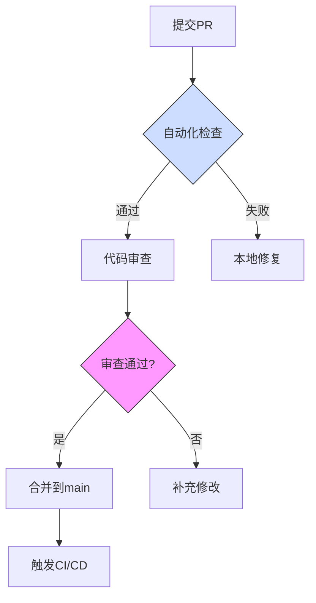

## 组件设计

### 组件设计原则

1. **单一职责**：每个组件只负责一个功能
2. **可组合性**：组件应易于组合使用
3. **可测试性**：组件应易于测试
4. **可访问性**：遵循 WCAG 2.1 标准

### 性能优化

1. **组件懒加载**：使用 React.lazy 和 Suspense
2. **图片优化**：使用 Next.js Image 组件
3. **代码分割**：按路由分割代码
4. **缓存策略**：适当使用 useMemo 和 useCallback

### 代码风格

1. **TypeScript**：使用严格模式
2. **函数组件**：优先使用函数组件和 Hooks
3. **命名约定**：使用描述性命名
4. **注释**：为复杂逻辑添加注释

## 主题系统

使用 next-themes 和 Tailwind CSS 实现明暗主题切换：

1. **主题定义**：在 Tailwind 配置中定义颜色变量
2. **主题切换**：使用 ThemeProvider 和 useTheme hook
3. **组件适配**：组件使用主题相关的 Tailwind 类

## 动画系统

动画使用 Framer Motion 实现，并在 `lib/animations.ts` 中集中定义常用动画：

- **页面过渡**：页面切换动画
- **元素动画**：元素进入、退出和交互动画
- **微交互**：按钮点击、悬停等小型交互动画

## 动画指南

1. **一致性**：使用预定义的动画变体
2. **性能**：优先使用 CSS 转换和不触发重排的属性
3. **可访问性**：尊重用户的减少动画偏好设置
4. **目的性**：动画应有明确目的，增强用户体验

## 代码质量管理

### 代码审查流程



### 审查标准
1. **架构规范**：
   - 符合SOLID原则
   - 模块依赖关系合理
2. **代码异味检测**：
   ```bash
   # 使用ESLint进行静态检测
   pnpm run lint --fix
   
   # 检测测试覆盖率
   pnpm test --coverage
   ```
3. **安全审查**：
   - 使用OWASP ZAP进行漏洞扫描
   - 依赖项审计：`pnpm audit`