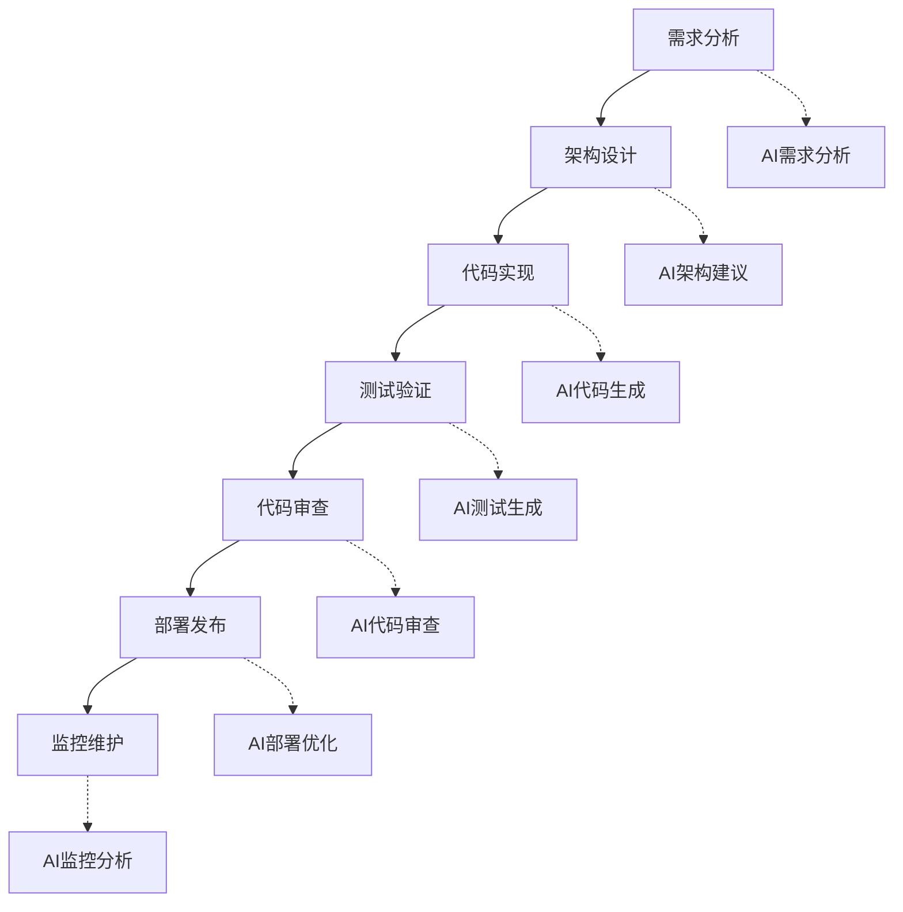

# AI 辅助开发工作流程

AI工具正在革命性地改变软件开发流程。本指南将帮助您构建一个高效的AI辅助开发工作流程。

## 工作流程概览

### 开发生命周期中的AI应用



### 核心工具链

**主要AI工具**：
- **GitHub Copilot**：代码生成和补全
- **ChatGPT/Claude**：问题解决和代码审查
- **Cursor**：AI原生编程环境
- **v0.dev**：UI组件生成

**辅助工具**：
- **Tabnine**：智能代码补全
- **CodeWhisperer**：AWS代码建议
- **Replit Ghostwriter**：在线AI编程
- **Sourcegraph Cody**：代码搜索和理解

## 阶段一：需求分析和设计

### 1.1 需求澄清

**AI辅助需求分析**：
```
作为产品分析师，请帮我分析以下需求：

原始需求：[用户需求描述]

请提供：
1. 需求澄清问题列表
2. 功能点分解
3. 技术可行性评估
4. 潜在风险识别
5. 优先级建议

输出格式：结构化的需求分析报告
```

### 1.2 技术选型

**架构设计咨询**：
```
作为系统架构师，请为以下项目推荐技术栈：

项目信息：
- 类型：[项目类型]
- 规模：[团队规模/用户规模]
- 性能要求：[具体要求]
- 预算限制：[预算情况]
- 时间限制：[开发周期]

请提供：
1. 前端技术栈推荐
2. 后端技术栈推荐
3. 数据库选择
4. 部署方案
5. 第三方服务建议
```

### 1.3 API设计

**RESTful API设计**：
```
请设计一个用户管理系统的RESTful API：

功能需求：
- 用户注册/登录
- 用户信息管理
- 权限控制
- 密码重置

请提供：
1. 完整的API端点列表
2. 请求/响应格式
3. 错误码定义
4. 认证方案
5. OpenAPI规范文档
```

## 阶段二：代码实现

### 2.1 项目初始化

**项目脚手架生成**：
```bash
# 使用AI生成项目结构
npx create-next-app@latest my-project --typescript --tailwind --eslint

# AI辅助配置文件生成
# 请求AI生成：
# - tsconfig.json优化配置
# - eslint.config.js规则
# - prettier.config.js格式化
# - package.json脚本命令
```

**环境配置**：
```
请帮我配置一个现代化的前端开发环境：

技术栈：Next.js 14 + TypeScript + Tailwind CSS
需求：
- 代码质量检查（ESLint + Prettier）
- 提交规范（Husky + Commitlint）
- 测试环境（Jest + Testing Library）
- 构建优化配置

请提供完整的配置文件和安装命令。
```

### 2.2 核心功能开发

**组件生成工作流**：

1. **需求描述** → AI生成基础组件
2. **功能细化** → AI优化组件逻辑
3. **样式调整** → AI生成CSS样式
4. **测试编写** → AI生成测试用例

**示例：用户登录组件**：
```
请创建一个React登录组件：

要求：
- 使用TypeScript
- 表单验证（email格式、密码强度）
- 错误处理和加载状态
- 响应式设计
- 无障碍支持
- 使用Tailwind CSS样式

请提供：
1. 组件代码
2. 类型定义
3. 样式实现
4. 使用示例
```

### 2.3 API开发

**后端API生成**：
```
请实现一个Node.js + Express的用户认证API：

功能：
- 用户注册
- 用户登录
- JWT令牌验证
- 密码重置

技术要求：
- TypeScript
- 数据验证（Joi）
- 错误处理中间件
- 安全最佳实践
- API文档注释

请提供完整的实现代码。
```

## 阶段三：测试和质量保证

### 3.1 自动化测试生成

**单元测试**：
```
请为以下函数生成完整的Jest测试用例：

[函数代码]

测试要求：
- 覆盖所有分支
- 包含边界条件测试
- 错误情况处理
- Mock外部依赖
- 性能测试（如适用）

请提供详细的测试代码和说明。
```

**集成测试**：
```
请为用户认证API生成集成测试：

API端点：
- POST /api/auth/register
- POST /api/auth/login
- GET /api/auth/profile

测试场景：
- 正常流程测试
- 错误处理测试
- 安全性测试
- 性能测试

使用Supertest + Jest框架。
```

### 3.2 代码质量检查

**代码审查提示**：
```
请审查以下代码并提供改进建议：

[代码内容]

审查重点：
1. 代码质量和可读性
2. 性能优化机会
3. 安全漏洞检查
4. 最佳实践遵循
5. 错误处理完整性
6. 类型安全（TypeScript）

请提供具体的修改建议和重构代码。
```

## 阶段四：部署和运维

### 4.1 CI/CD配置

**GitHub Actions工作流**：
```
请创建一个完整的CI/CD流水线：

项目：Next.js应用
部署目标：Vercel
要求：
- 代码质量检查
- 自动化测试
- 构建优化
- 安全扫描
- 自动部署
- 回滚机制

请提供完整的workflow配置文件。
```

### 4.2 监控和日志

**监控配置**：
```
请设计一个应用监控方案：

应用类型：Web应用 + API服务
监控需求：
- 性能监控
- 错误追踪
- 用户行为分析
- 服务健康检查
- 告警机制

推荐工具并提供配置示例。
```

## 团队协作工作流

### 5.1 代码协作

**Pull Request模板**：
```
## AI辅助开发PR模板

### 变更说明
- [ ] 功能开发
- [ ] Bug修复
- [ ] 性能优化
- [ ] 重构

### AI工具使用
- 使用的AI工具：[工具名称]
- AI生成代码比例：[百分比]
- 人工审查和修改：[说明]

### 测试覆盖
- [ ] 单元测试
- [ ] 集成测试
- [ ] E2E测试
- [ ] 性能测试

### 检查清单
- [ ] 代码符合团队规范
- [ ] AI生成代码已人工审查
- [ ] 测试覆盖率达标
- [ ] 文档已更新
```

### 5.2 知识分享

**AI使用规范**：
```markdown
# 团队AI使用规范

## 允许的用途
- 代码生成和补全
- 代码审查和优化
- 文档编写
- 测试用例生成
- 问题诊断和解决

## 禁止的用途
- 直接复制粘贴未审查的代码
- 处理敏感数据和密钥
- 替代人工代码审查
- 生成生产环境配置

## 质量控制
- 所有AI生成代码必须人工审查
- 关键功能必须编写测试
- 定期评估AI工具效果
- 分享最佳实践和经验
```

## 效率提升技巧

### 6.1 快捷工作流

**VS Code + Copilot工作流**：
```javascript
// 1. 写注释描述功能
// 创建一个用户认证中间件，验证JWT令牌

// 2. Copilot自动生成代码框架
const authMiddleware = async (req, res, next) => {
  // AI生成的代码
};

// 3. 人工审查和优化
// 4. 添加错误处理和类型注解
// 5. 编写测试用例
```

**命令行AI助手**：
```bash
# 使用AI生成常用命令
alias ai-commit="git add . && git commit -m '$(ai generate commit message)'"
alias ai-deploy="ai generate deployment script"
alias ai-test="ai generate test command for current project"
```

### 6.2 模板和片段

**代码片段库**：
```json
{
  "React Component with AI": {
    "prefix": "aic",
    "body": [
      "// AI生成的React组件模板",
      "interface ${1:Component}Props {",
      "  $2",
      "}",
      "",
      "export function ${1:Component}({ $3 }: ${1:Component}Props) {",
      "  // TODO: 使用AI完善组件逻辑",
      "  return (",
      "    <div>",
      "      $4",
      "    </div>",
      "  );",
      "}"
    ]
  }
}
```

## 常见问题和解决方案

### Q1: AI生成的代码质量不稳定

**解决方案**：
- 使用更具体的提示词
- 建立代码审查流程
- 创建团队编码规范
- 定期评估和调整AI工具

### Q2: 过度依赖AI工具

**解决方案**：
- 保持编程基础技能训练
- 定期进行无AI编程练习
- 理解AI生成代码的原理
- 建立人工验证机制

### Q3: 团队协作中的一致性问题

**解决方案**：
- 统一AI工具和版本
- 建立共享的提示词库
- 定期同步最佳实践
- 使用代码格式化工具

## 未来发展趋势

### 技术演进
- **更智能的代码生成**：理解项目上下文
- **自动化测试生成**：基于代码自动生成测试
- **智能代码审查**：AI辅助的代码质量检查
- **自适应开发环境**：根据项目自动配置

### 工作流程优化
- **端到端AI辅助**：从需求到部署的全流程
- **智能项目管理**：AI辅助的任务分配和进度跟踪
- **自动化文档生成**：基于代码自动生成文档
- **预测性维护**：AI预测和预防潜在问题

## 总结

AI辅助开发工作流程的关键是：

1. **合理集成**：将AI工具自然融入现有工作流
2. **质量控制**：建立有效的审查和验证机制
3. **持续学习**：跟上AI技术的发展趋势
4. **团队协作**：建立统一的AI使用规范
5. **效率平衡**：在效率和质量之间找到平衡

记住，AI是强大的助手，但不能替代开发者的判断和创造力。最好的工作流程是人机协作，发挥各自的优势。

## 相关资源

- [AI 工具对比与选择指南](./ai-tools-comparison.mdx)
- [提示词工程最佳实践](./prompt-engineering.mdx)
- [DeepSeek R1 完全指南](./deepseek-r1-complete-guide.mdx)
- [开发最佳实践](../guides/best-practices.mdx)
