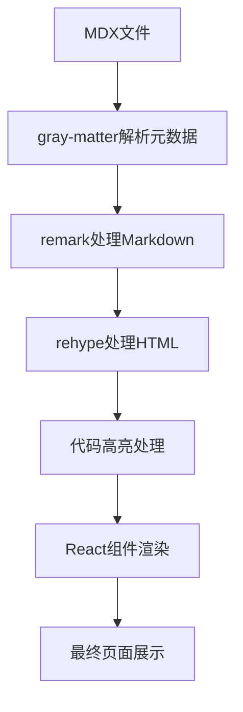

# MDX渲染组件

MDX渲染组件专门用于处理和渲染Markdown内容，支持代码高亮、自定义组件扩展等功能。

## MDX处理流程

### 1. 内容解析

项目使用以下库处理MDX内容：

- **@mdx-js/mdx**: MDX编译器
- **gray-matter**: 解析Frontmatter元数据
- **remark-gfm**: 支持GitHub Flavored Markdown
- **rehype-pretty-code**: 代码块美化
- **prismjs**: 代码语法高亮

### 2. 渲染流程



## 核心组件

### 1. MDXComponents (MDX组件映射)

定义MDX内容中HTML元素对应的React组件。

#### 基本配置

```tsx
// src/components/mdx/mdx-components.ts
import { MDXComponents } from 'mdx/types';
import { H1, H2, H3, H4, H5, H6 } from './mdx-heading';
import { P } from './mdx-paragraph';
import { A } from './mdx-link';
import { Blockquote } from './mdx-blockquote';
import { Pre } from './mdx-pre';
import { Code } from './mdx-code';
import { Img } from './mdx-img';

export const mdxComponents: MDXComponents = {
  h1: H1,
  h2: H2,
  h3: H3,
  h4: H4,
  h5: H5,
  h6: H6,
  p: P,
  a: A,
  blockquote: Blockquote,
  pre: Pre,
  code: Code,
  img: Img,
  // 其他HTML元素映射
};
```

#### 功能特性

- **元素映射**: 将HTML元素映射到自定义React组件
- **样式统一**: 保持MDX内容的样式一致性
- **功能扩展**: 支持自定义组件功能扩展
- **类型安全**: 提供完整的TypeScript类型支持

### 2. ClientMDXRenderer (客户端MDX渲染器)

在客户端渲染MDX内容的组件。

#### 基本用法

```tsx
import { ClientMDXRenderer } from '@/components/mdx/client-mdx-renderer';

<ClientMDXRenderer 
  content="# 标题\n\n内容..."
  components={mdxComponents}
/>
```

#### Props说明

| 属性名 | 类型 | 描述 |
|--------|------|------|
| content | string | MDX内容字符串 |
| components | MDXComponents | 自定义组件映射 |

#### 功能特性

- **动态渲染**: 支持动态渲染MDX内容
- **组件扩展**: 支持自定义组件扩展
- **安全处理**: 提供安全的内容渲染机制
- **性能优化**: 优化渲染性能

## 内容组件

### 1. 标题组件 (H1-H6)

处理Markdown标题元素的组件。

#### 基本实现

```tsx
// src/components/mdx/mdx-heading.tsx
import { cn } from '@/lib/utils';

interface HeadingProps extends React.HTMLAttributes<HTMLHeadingElement> {
  as?: 'h1' | 'h2' | 'h3' | 'h4' | 'h5' | 'h6';
}

const H1: React.FC<HeadingProps> = ({ className, ...props }) => (
  <h1
    className={cn(
      'scroll-m-20 text-4xl font-extrabold tracking-tight lg:text-5xl',
      className
    )}
    {...props}
  />
);

const H2: React.FC<HeadingProps> = ({ className, ...props }) => (
  <h2
    className={cn(
      'scroll-m-20 border-b pb-2 text-3xl font-semibold tracking-tight first:mt-0',
      className
    )}
    {...props}
  />
);

// 其他标题组件类似实现...
```

#### 功能特性

- **样式统一**: 提供一致的标题样式
- **锚点支持**: 支持标题锚点链接
- **响应式设计**: 在不同设备上自适应显示
- **可扩展性**: 支持自定义样式扩展

### 2. 段落组件 (P)

处理Markdown段落元素的组件。

#### 基本实现

```tsx
// src/components/mdx/mdx-paragraph.tsx
import { cn } from '@/lib/utils';

interface ParagraphProps extends React.HTMLAttributes<HTMLParagraphElement> {}

const P: React.FC<ParagraphProps> = ({ className, ...props }) => (
  <p
    className={cn('leading-7 [&:not(:first-child)]:mt-6', className)}
    {...props}
  />
);
```

#### 功能特性

- **行高优化**: 提供合适的行高和间距
- **段落间距**: 自动处理段落间的间距
- **可读性**: 优化文本可读性
- **样式扩展**: 支持自定义样式

### 3. 链接组件 (A)

处理Markdown链接元素的组件。

#### 基本实现

```tsx
// src/components/mdx/mdx-link.tsx
import Link from 'next/link';
import { cn } from '@/lib/utils';

interface LinkProps extends React.AnchorHTMLAttributes<HTMLAnchorElement> {}

const A: React.FC<LinkProps> = ({ className, href = '', ...props }) => {
  // 外部链接使用原生a标签
  if (href.startsWith('http')) {
    return (
      <a
        className={cn('font-medium underline underline-offset-4', className)}
        href={href}
        target="_blank"
        rel="noopener noreferrer"
        {...props}
      />
    );
  }
  
  // 内部链接使用Next.js Link组件
  return (
    <Link
      className={cn('font-medium underline underline-offset-4', className)}
      href={href}
      {...props}
    />
  );
};
```

#### 功能特性

- **内外链区分**: 自动区分内部和外部链接
- **安全处理**: 外部链接添加安全属性
- **样式统一**: 提供一致的链接样式
- **可访问性**: 支持键盘导航和屏幕阅读器

### 4. 引用块组件 (Blockquote)

处理Markdown引用块元素的组件。

#### 基本实现

```tsx
// src/components/mdx/mdx-blockquote.tsx
import { cn } from '@/lib/utils';

interface BlockquoteProps extends React.BlockquoteHTMLAttributes<HTMLQuoteElement> {}

const Blockquote: React.FC<BlockquoteProps> = ({ className, ...props }) => (
  <blockquote
    className={cn('mt-6 border-l-2 pl-6 italic', className)}
    {...props}
  />
);
```

#### 功能特性

- **视觉区分**: 提供明显的视觉区分样式
- **间距优化**: 合理的内外边距设置
- **样式扩展**: 支持自定义样式扩展
- **语义化**: 使用语义化的HTML标签

### 5. 代码组件 (Code)

处理Markdown代码元素的组件。

#### 基本实现

```tsx
// src/components/mdx/mdx-code.tsx
import { cn } from '@/lib/utils';

interface CodeProps extends React.HTMLAttributes<HTMLElement> {
  inline?: boolean;
}

const Code: React.FC<CodeProps> = ({ className, inline = false, ...props }) => {
  if (inline) {
    return (
      <code
        className={cn(
          'relative rounded bg-muted px-[0.3rem] py-[0.2rem] font-mono text-sm font-semibold',
          className
        )}
        {...props}
      />
    );
  }
  
  // 代码块由Pre组件处理
  return <code className={className} {...props} />;
};
```

#### 功能特性

- **行内代码**: 处理行内代码样式
- **代码块**: 与Pre组件配合处理代码块
- **样式统一**: 提供一致的代码样式
- **可读性**: 优化代码可读性

### 6. 代码块组件 (Pre)

处理Markdown代码块元素的组件。

#### 基本实现

```tsx
// src/components/mdx/mdx-pre.tsx
import { cn } from '@/lib/utils';

interface PreProps extends React.HTMLAttributes<HTMLPreElement> {
  'data-language'?: string;
  'data-theme'?: string;
}

const Pre: React.FC<PreProps> = ({ className, ...props }) => (
  <pre
    className={cn(
      'mb-4 mt-6 overflow-x-auto rounded-lg border bg-muted p-4',
      className
    )}
    {...props}
  />
);
```

#### 功能特性

- **滚动支持**: 支持水平滚动查看长代码
- **边框样式**: 提供清晰的代码块边界
- **背景色**: 使用合适的背景色提高可读性
- **间距优化**: 合理的内外边距设置

### 7. 图片组件 (Img)

处理Markdown图片元素的组件。

#### 基本实现

```tsx
// src/components/mdx/mdx-img.tsx
import { cn } from '@/lib/utils';
import Image from 'next/image';

interface ImgProps extends React.ImgHTMLAttributes<HTMLImageElement> {}

const Img: React.FC<ImgProps> = ({ className, src, alt, ...props }) => {
  if (!src) return null;
  
  // 外部图片使用原生img标签
  if (src.startsWith('http')) {
    return (
      
    );
  }
  
  // 本地图片使用Next.js Image组件
  return (
    <div className="relative my-6 overflow-hidden rounded-md">
      <Image
        className={cn('w-full', className)}
        src={src}
        alt={alt || ''}
        width={800}
        height={400}
        {...props}
      />
    </div>
  );
};
```

#### 功能特性

- **内外图区分**: 自动区分内部和外部图片
- **优化加载**: 使用Next.js Image组件优化加载
- **响应式**: 支持响应式图片显示
- **圆角处理**: 提供一致的圆角样式

## 代码高亮

### 1. PrismJS集成

项目使用PrismJS实现代码语法高亮。

#### 基本配置

```tsx
// src/lib/utils/code-highlight.ts
import Prism from 'prismjs';
import 'prismjs/components/prism-typescript';
import 'prismjs/components/prism-jsx';
import 'prismjs/components/prism-tsx';
import 'prismjs/components/prism-bash';
import 'prismjs/components/prism-json';

// 加载语言定义
export function loadPrismLanguage(language: string) {
  try {
    // Prism会自动加载对应语言的语法定义
    return Prism.languages[language];
  } catch (error) {
    console.warn(`Failed to load Prism language: ${language}`, error);
    return Prism.languages.text;
  }
}
```

#### 支持的语言

- **TypeScript**: typescript, ts
- **JavaScript**: javascript, js
- **JSX**: jsx
- **TSX**: tsx
- **Bash**: bash, shell
- **JSON**: json
- **CSS**: css
- **HTML**: html, xml

### 2. 代码行号

支持显示代码行号功能。

#### 实现方式

```tsx
// 在rehype处理阶段添加行号
const rehypePrettyCodeOptions = {
  theme: 'github-dark',
  onVisitLine(node: any) {
    // 添加行号类名
    if (node.children.length === 0) {
      node.children = [{ type: 'text', value: ' ' }];
    }
    node.properties.className = ['line'];
  },
  onVisitHighlightedLine(node: any) {
    // 添加高亮行类名
    node.properties.className?.push('line--highlighted');
  },
};
```

## 自定义组件扩展

### 1. 组件注册

支持注册自定义MDX组件。

#### 注册方式

```tsx
// src/components/mdx/custom-components.ts
import { Callout } from './callout';
import { Card } from './card';

export const customComponents = {
  Callout,
  Card,
  // 其他自定义组件
};
```

#### 使用示例

```mdx
# 文档标题

<Callout type="info">
  这是一个信息提示框
</Callout>

<Card title="卡片标题">
  卡片内容
</Card>
```

### 2. Callout组件

用于显示提示信息的自定义组件。

#### 基本实现

```tsx
// src/components/mdx/callout.tsx
import { cn } from '@/lib/utils';

interface CalloutProps {
  type?: 'info' | 'warning' | 'error' | 'success';
  children: React.ReactNode;
  className?: string;
}

const Callout: React.FC<CalloutProps> = ({ 
  type = 'info', 
  children, 
  className 
}) => {
  const typeStyles = {
    info: 'border-blue-200 bg-blue-50 text-blue-800',
    warning: 'border-yellow-200 bg-yellow-50 text-yellow-800',
    error: 'border-red-200 bg-red-50 text-red-800',
    success: 'border-green-200 bg-green-50 text-green-800',
  };
  
  return (
    <div
      className={cn(
        'my-6 rounded-lg border p-4',
        typeStyles[type],
        className
      )}
    >
      {children}
    </div>
  );
};
```

## 安全处理

### 1. 内容净化

防止XSS攻击的内容净化处理。

#### 实现方式

```tsx
// src/lib/utils/sanitize-content.ts
import sanitizeHtml from 'sanitize-html';

export function sanitizeContent(content: string): string {
  return sanitizeHtml(content, {
    allowedTags: [
      'h1', 'h2', 'h3', 'h4', 'h5', 'h6',
      'p', 'br', 'strong', 'em', 'u', 's',
      'ul', 'ol', 'li',
      'a', 'img',
      'code', 'pre',
      'blockquote',
      'table', 'thead', 'tbody', 'tr', 'th', 'td'
    ],
    allowedAttributes: {
      a: ['href', 'target', 'rel'],
      img: ['src', 'alt', 'width', 'height'],
      '*': ['class']
    },
    allowedSchemes: ['http', 'https', 'mailto'],
    transformTags: {
      'a': sanitizeHtml.simpleTransform('a', { target: '_blank', rel: 'noopener noreferrer' })
    }
  });
}
```

### 2. 外部资源处理

安全处理外部资源链接。

#### 实现方式

```tsx
// src/lib/utils/external-link-handler.ts
export function isExternalLink(url: string): boolean {
  try {
    const urlObj = new URL(url, 'http://localhost');
    return urlObj.origin !== 'http://localhost';
  } catch {
    return false;
  }
}

export function sanitizeExternalLink(url: string): string {
  if (!isExternalLink(url)) return url;
  
  // 添加安全属性
  return `${url}" target="_blank" rel="noopener noreferrer`;
}
```

## 性能优化

### 1. 懒加载

对大型MDX内容实现懒加载。

#### 实现方式

```tsx
import { lazy, Suspense } from 'react';

const LazyMDXRenderer = lazy(() => import('@/components/mdx/client-mdx-renderer'));

<Suspense fallback={<div>加载中...</div>}>
  <LazyMDXRenderer content={content} />
</Suspense>
```

### 2. 缓存策略

实现内容缓存提高渲染性能。

#### 实现方式

```tsx
// src/hooks/use-mdx-cache.ts
import { useState, useEffect } from 'react';

interface MDXCache {
  [key: string]: string;
}

export function useMDXCache() {
  const [cache, setCache] = useState<MDXCache>({});
  
  const getCachedContent = (key: string): string | null => {
    return cache[key] || null;
  };
  
  const setCachedContent = (key: string, content: string) => {
    setCache(prev => ({ ...prev, [key]: content }));
  };
  
  return { getCachedContent, setCachedContent };
}
```

通过这些MDX渲染组件，项目能够安全、高效地渲染Markdown内容，并提供丰富的功能扩展能力。