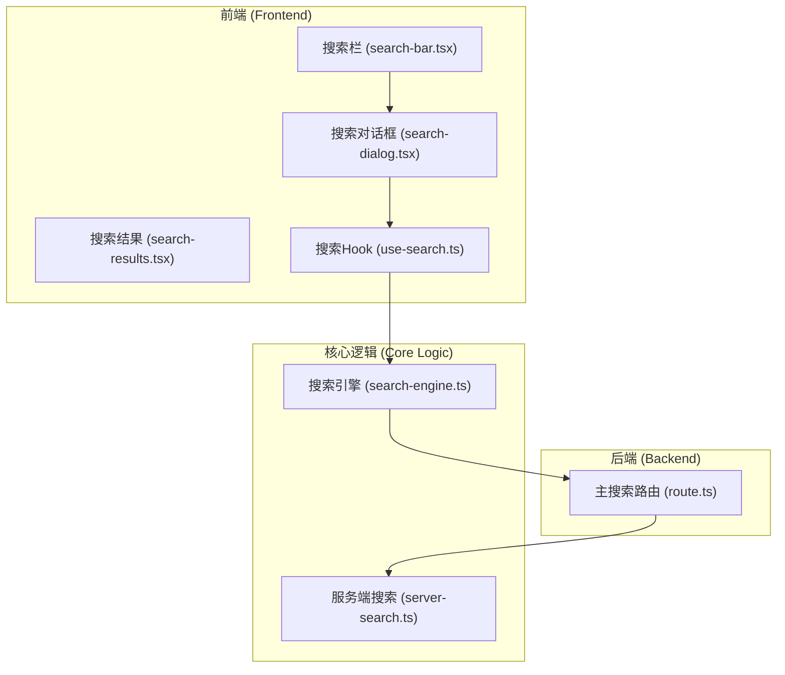
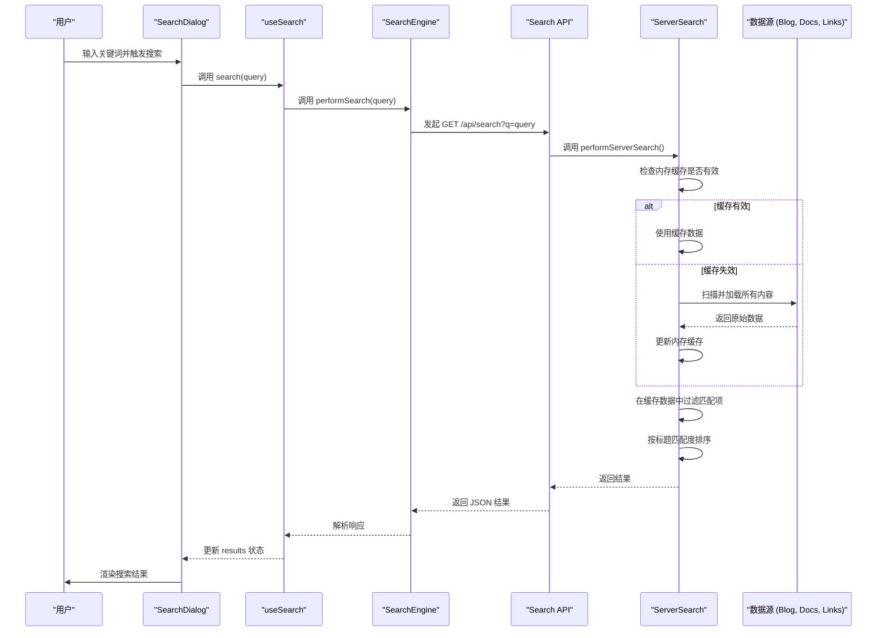

# 搜索功能开发指南

本文档详细介绍如何在斐流艺创项目中开发和维护全局搜索功能，包括架构设计、核心实现和最佳实践。

## 系统架构

### 整体架构

全局搜索功能采用前后端分离的架构设计：



### 数据流设计



## 核心实现

### 1. 前端组件

#### 搜索栏组件

创建 [src/features/search/components/search-bar.tsx](file://c:\project\official\src\features\search\components\search-bar.tsx)：

```tsx
import { Input } from "@/components/ui/input";
import { Loader2, Search, X } from "lucide-react";
import React, { forwardRef } from "react";

type SearchBarProps = React.ComponentPropsWithoutRef<typeof Input> & {
  isLoading?: boolean;
  onClear?: () => void;
  value?: string;
};

export const SearchBar = forwardRef<HTMLInputElement, SearchBarProps>(
  ({ isLoading, onClear, className, value, ...props }, ref) => (
    <div
      className={`group relative border-b border-border/30 transition-colors focus-within:bg-accent/15 hover:bg-accent/10 dark:border-border/20 ${className ?? ""}`}
    >
      <div className="pointer-events-none absolute top-1/2 left-2.5 -translate-y-1/2">
        <Search className="h-[14px] w-[14px] text-muted-foreground/60 transition-colors group-hover:text-muted-foreground/80" />
      </div>
      <Input
        ref={ref}
        className="w-full rounded-none border-0 bg-transparent px-2.5 py-2 pl-8 text-[15px] shadow-none outline-none placeholder:text-muted-foreground/50 focus-visible:ring-0 focus-visible:ring-offset-0 focus-visible:outline-none"
        placeholder="搜索或输入命令..."
        value={value}
        aria-label="搜索"
        {...props}
      />
      <div className="absolute top-1/2 right-2.5 flex -translate-y-1/2 items-center gap-2">
        {isLoading && (
          <Loader2 className="h-[14px] w-[14px] animate-spin text-muted-foreground/60" />
        )}
        {value && !isLoading && onClear && (
          <button
            type="button"
            onClick={onClear}
            className="inline-flex h-5 w-5 items-center justify-center rounded-sm opacity-60 transition-all hover:bg-accent/50 hover:opacity-100 focus:ring-1 focus:ring-ring focus:outline-none"
            aria-label="清除搜索"
          >
            <X className="h-[14px] w-[14px]" />
          </button>
        )}
      </div>
    </div>
  )
);

SearchBar.displayName = "SearchBar";
```

#### 搜索对话框组件

创建 [src/features/search/components/search-dialog.tsx](file://c:\project\official\src\features\search\components\search-dialog.tsx)：

```tsx
"use client";

import { SearchBar } from "@/features/search/components/search-bar";
import { useSearch } from "@/features/search/hooks/use-search";
import { SearchResults } from "@/features/search/components/search-results";
import { Dialog, DialogContent } from "@/components/ui/dialog";
import { useEffect, useRef } from "react";
import { useHotkeys } from "react-hotkeys-hook";

interface SearchDialogProps {
  open: boolean;
  onOpenChange: (open: boolean) => void;
}

export function SearchDialog({ open, onOpenChange }: SearchDialogProps) {
  const { search, results, isLoading, error, query, setQuery } = useSearch();
  const inputRef = useRef<HTMLInputElement>(null);

  // 注册快捷键
  useHotkeys("ctrl+k, cmd+k", (e) => {
    e.preventDefault();
    onOpenChange(true);
  });

  // 自动聚焦输入框
  useEffect(() => {
    if (open && inputRef.current) {
      inputRef.current.focus();
    }
  }, [open]);

  const handleSearch = async (searchQuery: string) => {
    setQuery(searchQuery);
    if (searchQuery.trim()) {
      await search(searchQuery, { type: "all", limit: 10 });
    }
  };

  const handleClear = () => {
    setQuery("");
  };

  return (
    <Dialog open={open} onOpenChange={onOpenChange}>
      <DialogContent className="gap-0 p-0 sm:max-w-lg">
        <div className="border-b border-border p-2">
          <SearchBar
            ref={inputRef}
            value={query}
            onChange={(e) => handleSearch(e.target.value)}
            onClear={handleClear}
            isLoading={isLoading}
          />
        </div>
        <div className="max-h-[60vh] overflow-y-auto">
          <SearchResults 
            results={results} 
            isLoading={isLoading} 
            error={error} 
            query={query} 
          />
        </div>
      </DialogContent>
    </Dialog>
  );
}
```

#### 搜索结果组件

创建 [src/features/search/components/search-results.tsx](file://c:\project\official\src\features\search\components\search-results.tsx)：

```tsx
import { SearchResult } from "@/features/search/types";
import { useRouter } from "next/navigation";
import { Button } from "@/components/ui/button";
import { FileText, Link, BookOpen } from "lucide-react";
import { highlightSearchTerm } from "@/features/search/lib/search-engine";

interface SearchResultsProps {
  results: SearchResult[];
  isLoading: boolean;
  error: string | null;
  query: string;
}

export function SearchResults({ results, isLoading, error, query }: SearchResultsProps) {
  const router = useRouter();

  if (isLoading) {
    return (
      <div className="p-4 text-center">
        <div className="inline-block h-6 w-6 animate-spin rounded-full border-2 border-current border-t-transparent" />
        <p className="mt-2 text-sm text-muted-foreground">搜索中...</p>
      </div>
    );
  }

  if (error) {
    return (
      <div className="p-4 text-center">
        <p className="text-sm text-destructive">搜索失败: {error}</p>
      </div>
    );
  }

  if (!query.trim()) {
    return (
      <div className="p-4 text-center">
        <p className="text-sm text-muted-foreground">输入关键词开始搜索</p>
      </div>
    );
  }

  if (results.length === 0) {
    return (
      <div className="p-4 text-center">
        <p className="text-sm text-muted-foreground">未找到相关结果</p>
      </div>
    );
  }

  const getIcon = (type: string) => {
    switch (type) {
      case "link":
        return <Link className="h-4 w-4" />;
      case "blog":
        return <FileText className="h-4 w-4" />;
      case "doc":
        return <BookOpen className="h-4 w-4" />;
      default:
        return <FileText className="h-4 w-4" />;
    }
  };

  const getTypeLabel = (type: string) => {
    switch (type) {
      case "link":
        return "链接";
      case "blog":
        return "博客";
      case "doc":
        return "文档";
      default:
        return "内容";
    }
  };

  const handleClick = (result: SearchResult) => {
    if (result.path) {
      router.push(result.path);
    } else if (result.url) {
      window.open(result.url, "_blank");
    }
  };

  return (
    <div className="divide-y divide-border">
      {results.map((result, index) => (
        <Button
          key={index}
          variant="ghost"
          className="w-full justify-start rounded-none px-4 py-3 h-auto text-left"
          onClick={() => handleClick(result)}
        >
          <div className="flex items-start gap-3">
            <div className="mt-0.5 text-muted-foreground">
              {getIcon(result.type)}
            </div>
            <div className="flex-1 min-w-0">
              <div className="flex items-center gap-2">
                <span className="text-xs font-medium text-muted-foreground bg-muted px-1.5 py-0.5 rounded">
                  {getTypeLabel(result.type)}
                </span>
              </div>
              <h3 
                className="font-medium mt-1 truncate"
                dangerouslySetInnerHTML={{
                  __html: highlightSearchTerm(result.title, query)
                }}
              />
              {result.description && (
                <p 
                  className="text-sm text-muted-foreground mt-1 line-clamp-2"
                  dangerouslySetInnerHTML={{
                    __html: highlightSearchTerm(result.description, query)
                  }}
                />
              )}
              {result.excerpt && (
                <p 
                  className="text-sm text-muted-foreground mt-1 line-clamp-2"
                  dangerouslySetInnerHTML={{
                    __html: highlightSearchTerm(result.excerpt, query)
                  }}
                />
              )}
            </div>
          </div>
        </Button>
      ))}
    </div>
  );
}
```

### 2. React Hooks

#### 搜索Hook

创建 [src/features/search/hooks/use-search.ts](file://c:\project\official\src\features\search\hooks\use-search.ts)：

```tsx
/**
 * 搜索功能 React Hook
 */

import { getSearchSuggestions, performSearch } from "@/features/search/lib/search-engine";
import type { SearchOptions, SearchResult } from "@/features/search/types";
import { useCallback, useEffect, useState } from "react";

interface UseSearchReturn {
  search: (query: string, options?: SearchOptions) => Promise<void>;
  results: SearchResult[];
  isLoading: boolean;
  error: string | null;
  query: string;
  suggestions: string[];
  getSuggestions: (query: string) => Promise<void>;
  setQuery: (query: string) => void;
}

export function useSearch(): UseSearchReturn {
  const [results, setResults] = useState<SearchResult[]>([]);
  const [isLoading, setIsLoading] = useState(false);
  const [error, setError] = useState<string | null>(null);
  const [query, setQuery] = useState("");
  const [suggestions, setSuggestions] = useState<string[]>([]);

  const search = useCallback(
    async (searchQuery: string, options?: SearchOptions): Promise<void> => {
      setIsLoading(true);
      setError(null);
      setQuery(searchQuery);

      try {
        const response = await performSearch(searchQuery, options);
        setResults(response.results);
      } catch (err) {
        const errorMessage = err instanceof Error ? err.message : "Search failed";
        setError(errorMessage);
        setResults([]);
      } finally {
        setIsLoading(false);
      }
    },
    []
  );

  const getSuggestions = useCallback(async (searchQuery: string): Promise<void> => {
    try {
      const suggestionList = await getSearchSuggestions(searchQuery);
      setSuggestions(suggestionList);
    } catch (err) {
      console.error("Failed to get suggestions:", err);
      setSuggestions([]);
    }
  }, []);

  // 清理建议当查询为空时
  useEffect(() => {
    if (!query.trim()) {
      setSuggestions([]);
    }
  }, [query]);

  return {
    search,
    results,
    isLoading,
    error,
    query,
    suggestions,
    getSuggestions,
    setQuery,
  };
}
```

#### 搜索状态Hook

创建 [src/features/search/hooks/use-search-state.ts](file://c:\project\official\src\features\search\hooks\use-search-state.ts)：

```tsx
/**
 * 搜索状态管理 React Hook
 * 集成 Zustand 状态管理
 */

import { getSearchSuggestions, performSearch } from "@/features/search/lib/search-engine";
import type { SearchOptions, SearchResult } from "@/features/search/types";
import { useCallback, useEffect, useState } from "react";
import { useSearchStore } from "@/stores";

interface UseSearchStateReturn {
  search: (query: string, options?: SearchOptions) => Promise<void>;
  results: SearchResult[];
  isLoading: boolean;
  error: string | null;
  query: string;
  suggestions: string[];
  getSuggestions: (query: string) => Promise<void>;
  // Zustand 状态
  searchTerm: string;
  selectedCategory: string;
  setSearchTerm: (term: string) => void;
  setSelectedCategory: (category: string) => void;
  resetSearch: () => void;
  setQuery: (query: string) => void;
}

export function useSearchState(): UseSearchStateReturn {
  // 使用 Zustand 管理搜索状态
  const { searchTerm, selectedCategory, setSearchTerm, setSelectedCategory, resetSearch } =
    useSearchStore();

  // 本地状态管理搜索结果和加载状态
  const [results, setResults] = useState<SearchResult[]>([]);
  const [isLoading, setIsLoading] = useState(false);
  const [error, setError] = useState<string | null>(null);
  const [query, setQuery] = useState("");

  // 当 Zustand 中的搜索词改变时，更新本地查询状态
  useEffect(() => {
    setQuery(searchTerm);
  }, [searchTerm]);

  const search = useCallback(
    async (searchQuery: string, options?: SearchOptions): Promise<void> => {
      // 更新 Zustand 状态
      setSearchTerm(searchQuery);

      setIsLoading(true);
      setError(null);
      setQuery(searchQuery);

      try {
        const response = await performSearch(searchQuery, options);
        setResults(response.results);
      } catch (err) {
        const errorMessage = err instanceof Error ? err.message : "Search failed";
        setError(errorMessage);
        setResults([]);
      } finally {
        setIsLoading(false);
      }
    },
    [setSearchTerm]
  );

  const getSuggestions = useCallback(async (searchQuery: string): Promise<void> => {
    try {
      const suggestionList = await getSearchSuggestions(searchQuery);
      setSuggestions(suggestionList);
    } catch (err) {
      console.error("Failed to get suggestions:", err);
      setSuggestions([]);
    }
  }, []);

  // 清理建议当查询为空时
  useEffect(() => {
    if (!query.trim()) {
      setSuggestions([]);
    }
  }, [query]);

  return {
    search,
    results,
    isLoading,
    error,
    query,
    suggestions,
    getSuggestions,
    searchTerm,
    selectedCategory,
    setSearchTerm,
    setSelectedCategory,
    resetSearch,
    setQuery,
  };
}
```

### 3. 核心逻辑

#### 搜索引擎

创建 [src/features/search/lib/search-engine.ts](file://c:\project\official\src\features\search\lib\search-engine.ts)：

```tsx
/**
 * 搜索引擎核心功能
 */

import type { SearchOptions, SearchResponse, SearchResult } from "@/features/search/types";

/**
 * 执行搜索
 */
export async function performSearch(
  query: string,
  options: SearchOptions = {}
): Promise<SearchResponse> {
  const { type = "all", limit = 10 } = options;

  if (!query.trim()) {
    return {
      results: [],
      total: 0,
      query,
      type,
    };
  }

  try {
    const searchParams = new URLSearchParams({
      q: query.trim(),
      type,
      ...(limit && { limit: limit.toString() }),
    });

    const response = await fetch(`/api/search?${searchParams}`);

    if (!response.ok) {
      throw new Error(`Search failed: ${response.status}`);
    }

    const data: { results: SearchResult[] } = (await response.json()) as {
      results: SearchResult[];
    };

    return {
      results: data.results || [],
      total: data.results?.length || 0,
      query,
      type,
    } as SearchResponse;
  } catch (error) {
    console.error("Search error:", error);
    return {
      results: [],
      total: 0,
      query,
      type,
    };
  }
}

/**
 * 搜索建议
 */
export function getSearchSuggestions(query: string, _limit = 5): string[] {
  if (!query.trim() || query.length < 2) {
    return [];
  }

  try {
    // 这里可以实现搜索建议的逻辑
    // 暂时返回空数组，后续可以扩展
    return [];
  } catch (error) {
    console.error("Search suggestions error:", error);
    return [];
  }
}

/**
 * 高亮搜索关键词
 */
export function highlightSearchTerm(text: string, searchTerm: string): string {
  if (!searchTerm.trim()) {
    return text;
  }

  try {
    const escapedTerm = searchTerm.replace(/[.*+?^${}()|[\]\\]/g, "\\$&");
    const regex = new RegExp(`(${escapedTerm})`, "gi");
    return text.replace(regex, '<mark class="bg-yellow-200 dark:bg-yellow-800">$1</mark>');
  } catch (error) {
    console.error("Highlight error:", error);
    return text;
  }
}
```

#### 服务端搜索

创建 [src/features/search/lib/server-search.ts](file://c:\project\official\src\features\search\lib\server-search.ts)：

```tsx
/**
 * 服务端搜索工具函数
 * 仅用于 API routes 和其他服务端环境，不应在客户端导入
 */

import { promises as fs } from "node:fs";
import path from "node:path";
import { loadAllCategoriesData } from "@/features/links/lib/categories";
import { glob } from "fast-glob";
import matter from "gray-matter";
import type { SearchResult } from "../types";

interface LinkItem {
  title: string;
  description?: string;
  url?: string;
  tags?: string[];
}

// 内存缓存
let contentCache: {
  blogs: SearchResult[];
  docs: SearchResult[];
  timestamp: number;
} | null = null;

const CACHE_TTL = 5 * 60 * 1000; // 5分钟缓存

/**
 * 扫描内容文件（博客/文档）
 */
async function scanContentFiles(contentType: "blog" | "docs"): Promise<SearchResult[]> {
  const basePath = path.join(process.cwd(), `src/content/${contentType}`);
  const files = await glob("**/*.mdx", { cwd: basePath });
  const results: SearchResult[] = [];

  for (const file of files) {
    try {
      const filePath = path.join(basePath, file);
      const content = await fs.readFile(filePath, "utf-8");
      const { data: frontmatter, content: markdown } = matter(content);
      
      const urlPath = `/${contentType}/${file.replace(/\.mdx$/, "")}`;
      
      results.push({
        type: contentType === "blog" ? "blog" : "doc",
        title: frontmatter.title ?? "",
        description: frontmatter.description ?? "",
        content: markdown,
        path: urlPath,
        date: frontmatter.date,
        tags: frontmatter.tags,
      });
    } catch (error) {
      console.error(`Error reading ${file}:`, error);
    }
  }

  return results;
}

/**
 * 搜索链接
 */
async function searchLinks(query: string, limit = 5): Promise<SearchResult[]> {
  const categories = await loadAllCategoriesData();
  const links: LinkItem[] = [];
  
  // 收集所有链接
  for (const category of Object.values(categories)) {
    if (category.items) {
      links.push(...category.items);
    }
  }
  
  const queryLower = query.toLowerCase();
  
  return links
    .filter((item: LinkItem) => {
      const searchText = `${item.title} ${item.description} ${item.tags?.join(" ")}`.toLowerCase();
      return searchText.includes(queryLower);
    })
    .map((item: LinkItem) => ({
      type: "link" as const,
      title: item.title,
      description: item.description,
      url: item.url,
      tags: item.tags,
    }))
    .slice(0, limit);
}

/**
 * 获取缓存的内容数据
 */
async function getCachedContent() {
  const now = Date.now();
  
  // 检查缓存是否有效
  if (contentCache && now - contentCache.timestamp < CACHE_TTL) {
    return {
      blogs: contentCache.blogs,
      docs: contentCache.docs,
    };
  }
  
  // 重新扫描内容
  const [blogs, docs] = await Promise.all([
    scanContentFiles("blog"),
    scanContentFiles("docs"),
  ]);
  
  // 更新缓存
  contentCache = {
    blogs,
    docs,
    timestamp: now,
  };
  
  return { blogs, docs };
}

/**
 * 执行服务端搜索
 */
export async function performServerSearch(
  query: string,
  type = "all",
  limit = 10
): Promise<{ results: SearchResult[]; total: number }> {
  if (!query.trim()) {
    return { results: [], total: 0 };
  }

  const { blogs, docs } = await getCachedContent();
  const results: SearchResult[] = [];
  const queryLower = query.toLowerCase();

  // 搜索链接
  if (type === "all" || type === "links") {
    const linkResults = await searchLinks(query, 5);
    results.push(...linkResults);
  }

  // 搜索博客
  if (type === "all" || type === "blog") {
    const blogResults = blogs
      .filter(post => {
        const searchText =
          `${post.title} ${post.description} ${post.tags?.join(" ")}`.toLowerCase();
        return searchText.includes(queryLower);
      })
      .slice(0, 5);
    results.push(...blogResults);
  }

  // 搜索文档
  if (type === "all" || type === "doc" || type === "docs") {
    const docResults = docs
      .filter(doc => {
        const searchText =
          `${doc.title} ${doc.description} ${doc.tags?.join(" ")}`.toLowerCase();
        return searchText.includes(queryLower);
      })
      .slice(0, 5);
    results.push(...docResults);
  }

  // 按匹配度排序（简单实现：标题匹配优先）
  results.sort((a, b) => {
    const aTitleMatch = a.title.toLowerCase().includes(queryLower) ? 1 : 0;
    const bTitleMatch = b.title.toLowerCase().includes(queryLower) ? 1 : 0;
    return bTitleMatch - aTitleMatch;
  });

  return {
    results: results.slice(0, limit),
    total: results.length,
  };
}
```

### 4. API路由

#### 主搜索路由

创建 [src/app/api/search/route.ts](file://c:\project\official\src\app\api\search\route.ts)：

```tsx
import { type NextRequest, NextResponse } from "next/server";
import { performServerSearch } from "@/features/search/lib/server-search";

// biome-ignore lint/style/useNamingConvention: Next.js API 路由标准命名
export async function GET(request: NextRequest) {
  try {
    const { searchParams } = new URL(request.url);
    const query = searchParams.get("q")?.trim() ?? "";
    const type = searchParams.get("type") ?? "all";
    const limit = Number.parseInt(searchParams.get("limit") ?? "10", 10);

    if (!query) {
      return NextResponse.json({ results: [] });
    }

    const startTime = Date.now();
    const { results, total } = await performServerSearch(query, type, limit);
    const endTime = Date.now();

    return NextResponse.json({
      success: true,
      data: {
        results,
        total,
        took: endTime - startTime,
      },
      timestamp: new Date().toISOString(),
    });
  } catch (error) {
    console.error("Search error:", error);
    return NextResponse.json(
      {
        success: false,
        error: {
          code: "SEARCH_FAILED",
          message: "搜索失败",
        },
        timestamp: new Date().toISOString(),
      },
      { status: 500 }
    );
  }
}
```

#### 博客搜索路由

创建 [src/app/api/search/blog/route.ts](file://c:\project\official\src\app\api\search\blog\route.ts)：

```tsx
import { type NextRequest, NextResponse } from "next/server";
import { glob } from "fast-glob";
import path from "node:path";
import { promises as fs } from "node:fs";
import matter from "gray-matter";

interface BlogPost {
  title: string;
  description?: string;
  content: string;
  url: string;
  date?: string;
}

async function getBlogPosts(): Promise<BlogPost[]> {
  const blogPath = path.join(process.cwd(), "src/content/blog");
  const files = await glob("**/*.mdx", { cwd: blogPath });
  const posts: BlogPost[] = [];

  for (const file of files) {
    try {
      const filePath = path.join(blogPath, file);
      const content = await fs.readFile(filePath, "utf-8");
      const { data: frontmatter, content: markdown } = matter(content);
      
      const url = `/blog/${file.replace(/\.mdx$/, "")}`;
      
      posts.push({
        title: frontmatter.title ?? "",
        description: frontmatter.description ?? "",
        content: markdown,
        url,
        date: frontmatter.date ?? "",
      });
    } catch (error) {
      console.error(`Error reading blog post ${file}:`, error);
    }
  }

  return posts;
}

// biome-ignore lint/style/useNamingConvention: Next.js API 路由标准命名
export async function GET(request: NextRequest) {
  try {
    const { searchParams } = new URL(request.url);
    const query = searchParams.get("q")?.trim() ?? "";
    const limit = Number.parseInt(searchParams.get("limit") ?? "5", 10);

    if (!query) {
      return NextResponse.json(
        {
          success: false,
          error: {
            code: "INVALID_PARAMETERS",
            message: "参数验证失败",
            details: {
              q: "搜索关键词不能为空",
            },
          },
          timestamp: new Date().toISOString(),
        },
        { status: 400 }
      );
    }

    const startTime = Date.now();
    const blogPosts = await getBlogPosts();
    
    const searchResults = blogPosts
      .filter(post => {
        const searchContent = `${post.title} ${post.description}`.toLowerCase();
        return searchContent.includes(query.toLowerCase());
      })
      .map(post => ({
        type: "blog" as const,
        title: post.title,
        description: post.description,
        path: post.url,
        excerpt: post.description || `${post.content.slice(0, 160)}...`,
        date: post.date,
      }))
      .slice(0, limit);

    const endTime = Date.now();

    return NextResponse.json({
      success: true,
      data: {
        results: searchResults,
        total: searchResults.length,
        took: endTime - startTime,
      },
      timestamp: new Date().toISOString(),
    });
  } catch (error) {
    console.error("Error searching blog posts:", error);
    return NextResponse.json(
      {
        success: false,
        error: {
          code: "INTERNAL_ERROR",
          message: "内部服务器错误",
        },
        timestamp: new Date().toISOString(),
      },
      { status: 500 }
    );
  }
}
```

#### 文档搜索路由

创建 [src/app/api/search/docs/route.ts](file://c:\project\official\src\app\api\search\docs\route.ts)：

```tsx
import { type NextRequest, NextResponse } from "next/server";
import { glob } from "fast-glob";
import path from "node:path";
import { promises as fs } from "node:fs";
import matter from "gray-matter";

interface DocItem {
  title: string;
  description?: string;
  content: string;
  url: string;
  category?: string;
}

async function getDocs(): Promise<DocItem[]> {
  const docsPath = path.join(process.cwd(), "src/content/docs");
  const files = await glob("**/*.mdx", { cwd: docsPath });
  const docs: DocItem[] = [];

  for (const file of files) {
    // 跳过元数据文件
    if (file.endsWith("_meta.json")) continue;
    
    try {
      const filePath = path.join(docsPath, file);
      const content = await fs.readFile(filePath, "utf-8");
      const { data: frontmatter, content: markdown } = matter(content);
      
      const url = `/docs/${file.replace(/\.mdx$/, "")}`;
      
      docs.push({
        title: frontmatter.title ?? "",
        description: frontmatter.description ?? "",
        content: markdown,
        url,
        category: frontmatter.category ?? "",
      });
    } catch (error) {
      console.error(`Error reading doc ${file}:`, error);
    }
  }

  return docs;
}

// biome-ignore lint/style/useNamingConvention: Next.js API 路由标准命名
export async function GET(request: NextRequest) {
  try {
    const { searchParams } = new URL(request.url);
    const query = searchParams.get("q")?.trim() ?? "";
    const limit = Number.parseInt(searchParams.get("limit") ?? "5", 10);

    if (!query) {
      return NextResponse.json(
        {
          success: false,
          error: {
            code: "INVALID_PARAMETERS",
            message: "参数验证失败",
            details: {
              q: "搜索关键词不能为空",
            },
          },
          timestamp: new Date().toISOString(),
        },
        { status: 400 }
      );
    }

    const startTime = Date.now();
    const docs = await getDocs();
    
    const searchResults = docs
      .filter(doc => {
        const searchContent = `${doc.title} ${doc.description}`.toLowerCase();
        return searchContent.includes(query.toLowerCase());
      })
      .map(doc => ({
        type: "doc" as const,
        title: doc.title,
        description: doc.description,
        path: doc.url,
        excerpt: doc.description || `${doc.content.slice(0, 160)}...`,
      }))
      .slice(0, limit);

    const endTime = Date.now();

    return NextResponse.json({
      success: true,
      data: {
        results: searchResults,
        total: searchResults.length,
        took: endTime - startTime,
      },
      timestamp: new Date().toISOString(),
    });
  } catch (error) {
    console.error("Error searching docs:", error);
    return NextResponse.json(
      {
        success: false,
        error: {
          code: "INTERNAL_ERROR",
          message: "内部服务器错误",
        },
        timestamp: new Date().toISOString(),
      },
      { status: 500 }
    );
  }
}
```

#### 链接搜索路由

创建 [src/app/api/search/links/route.ts](file://c:\project\official\src\app\api\search\links\route.ts)：

```tsx
import { type NextRequest, NextResponse } from "next/server";
import { loadAllCategoriesData } from "@/features/links/lib/categories";

interface LinkItem {
  title: string;
  description?: string;
  url?: string;
  tags?: string[];
}

// biome-ignore lint/style/useNamingConvention: Next.js API 路由标准命名
export async function GET(request: NextRequest) {
  try {
    const { searchParams } = new URL(request.url);
    const query = searchParams.get("q")?.trim() ?? "";
    const limit = Number.parseInt(searchParams.get("limit") ?? "5", 10);

    if (!query) {
      return NextResponse.json(
        {
          success: false,
          error: {
            code: "INVALID_PARAMETERS",
            message: "参数验证失败",
            details: {
              q: "搜索关键词不能为空",
            },
          },
          timestamp: new Date().toISOString(),
        },
        { status: 400 }
      );
    }

    const startTime = Date.now();
    const categories = await loadAllCategoriesData();
    const links: LinkItem[] = [];
    
    // 收集所有链接
    for (const category of Object.values(categories)) {
      if (category.items) {
        links.push(...category.items);
      }
    }
    
    const queryLower = query.toLowerCase();
    
    const searchResults = links
      .filter((item: LinkItem) => {
        const searchText = `${item.title} ${item.description} ${item.tags?.join(" ")}`.toLowerCase();
        return searchText.includes(queryLower);
      })
      .map((item: LinkItem) => ({
        type: "link" as const,
        title: item.title,
        description: item.description,
        url: item.url,
        tags: item.tags,
      }))
      .slice(0, limit);

    const endTime = Date.now();

    return NextResponse.json({
      success: true,
      data: {
        results: searchResults,
        total: searchResults.length,
        took: endTime - startTime,
      },
      timestamp: new Date().toISOString(),
    });
  } catch (error) {
    console.error("Error searching links:", error);
    return NextResponse.json(
      {
        success: false,
        error: {
          code: "INTERNAL_ERROR",
          message: "内部服务器错误",
        },
        timestamp: new Date().toISOString(),
      },
      { status: 500 }
    );
  }
}
```

## 类型定义

创建 [src/features/search/types/index.ts](file://c:\project\official\src\features\search\types\index.ts)：

```tsx
/**
 * 搜索相关类型定义
 */

export interface SearchResult {
  type: "link" | "blog" | "doc" | "tool" | "command" | "navigation" | "history";
  title: string;
  description?: string;
  url?: string;
  path?: string;
  tags?: string[];
  /** 摘要（用于高级搜索结果） */
  excerpt?: string;
  /** 相关性评分 */
  score?: number;
  /** 是否为外部链接 */
  isExternal?: boolean;
  /** 高亮信息 */
  highlights?: {
    title?: string;
    content?: string[];
  };
  /** 日期信息 */
  date?: string;
}

export interface SearchOptions {
  type?: "all" | "links" | "blog" | "doc" | "docs";
  limit?: number;
  includeContent?: boolean;
  useCache?: boolean;
}

export interface SearchResponse {
  results: SearchResult[];
  total: number;
  query: string;
  type: string;
}
```

## 性能优化

### 1. 内存缓存

后端API使用内存缓存存储扫描到的数据，避免每次搜索都重新扫描文件系统：

```typescript
// 5分钟缓存
const CACHE_TTL = 5 * 60 * 1000;
```

### 2. 客户端防抖

前端通过防抖定时器避免用户在输入时频繁触发搜索请求：

```typescript
// 在 useSearch hook 中可以实现防抖逻辑
const debouncedSearch = useCallback(
  debounce((query: string) => {
    if (query.trim()) {
      search(query);
    }
  }, 300),
  [search]
);
```

### 3. 结果限制

后端对每个数据源的结果进行限制，控制数据传输量：

```typescript
// 限制每个数据源返回5条结果
const linkResults = await searchLinks(query, 5);
const blogResults = blogs.slice(0, 5);
const docResults = docs.slice(0, 5);
```

### 4. 异步加载

所有文件读取和网络请求均使用异步处理，保证UI流畅性。

## 扩展功能

### 1. 搜索建议

可以通过扩展 [getSearchSuggestions](file://c:\project\official\src\features\search\lib\search-engine.ts#L59-L73) 函数实现搜索建议功能：

```typescript
export function getSearchSuggestions(query: string, limit = 5): string[] {
  if (!query.trim() || query.length < 2) {
    return [];
  }

  try {
    // 实现搜索建议逻辑
    // 可以基于历史搜索记录或热门关键词
    return [];
  } catch (error) {
    console.error("Search suggestions error:", error);
    return [];
  }
}
```

### 2. 全文搜索

可以集成专业的全文搜索引擎如 [Fuse.js](https://fusejs.io/) 或 [Lunr.js](https://lunrjs.com/) 来实现更强大的全文搜索功能。

### 3. 搜索历史

可以通过浏览器 localStorage 或服务端存储实现搜索历史记录功能。

## 调试技巧

### 1. 开发工具

- 使用浏览器开发者工具查看网络请求
- 检查控制台错误信息
- 使用 React DevTools 检查组件状态

### 2. 日志调试

```typescript
// 在开发环境中启用详细日志
if (process.env.NODE_ENV === "development") {
  console.log("搜索参数:", { query, type, limit });
  console.log("搜索结果:", results);
}
```

### 3. 性能监控

```typescript
// 记录搜索耗时
const startTime = Date.now();
// ... 执行搜索 ...
const endTime = Date.now();
console.log(`搜索耗时: ${endTime - startTime}ms`);
```

## 常见问题

### 1. 搜索结果为空

检查以下几点：
- 确认搜索关键词不为空
- 检查内容文件是否正确格式化
- 验证API路由是否正常工作

### 2. 搜索响应慢

- 检查缓存是否正常工作
- 确认文件系统权限
- 查看服务器资源使用情况

### 3. 搜索高亮不工作

- 检查 [highlightSearchTerm](file://c:\project\official\src\features\search\lib\search-engine.ts#L75-L89) 函数实现
- 确认返回的HTML内容正确渲染

通过遵循这些开发指南和最佳实践，您可以成功地在斐流艺创项目中实现和维护全局搜索功能。