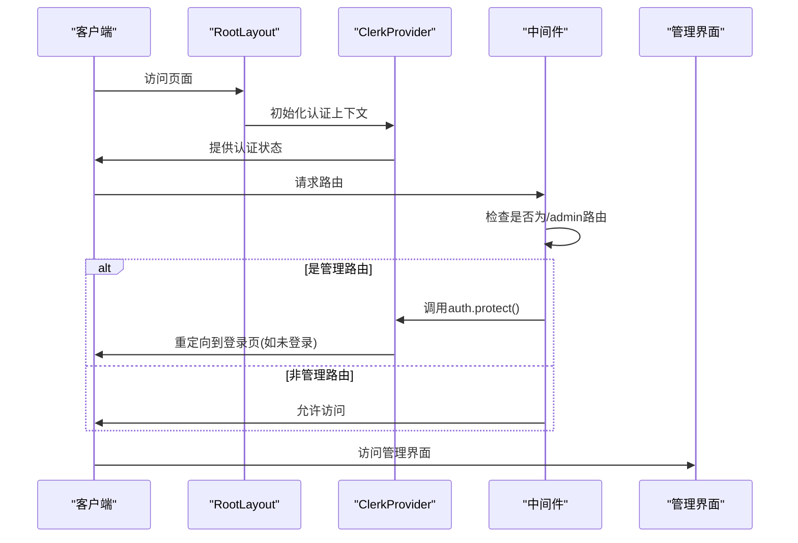

# 用户认证系统

用户认证系统是斐流艺创项目的安全基础，提供完整的用户注册、登录、权限管理和个人资料功能。

## 功能特性

### 1. 用户认证

- 用户注册和登录
- 第三方认证集成（GitHub、Google等）
- 密码重置功能
- 邮箱验证流程

### 2. 会话管理

- 安全的会话保持
- 自动会话过期
- 多设备登录管理
- 会话安全策略

### 3. 个人资料

- 用户头像和基本信息
- 社交链接管理
- 个人资料页面展示
- 资料编辑功能

### 4. 权限控制

- 基于角色的访问控制
- 管理后台访问限制
- 内容发布权限管理
- 安全审计日志

## 技术实现

### 系统架构

用户认证系统基于 Clerk 提供的完整解决方案：



### 核心组件

#### 认证按钮组件 (AuthButtons)

根据用户登录状态动态渲染不同UI：

- 未登录时显示登录按钮
- 已登录时显示用户菜单
- 加载状态处理

#### 用户资料组件 (UserProfile)

展示和管理用户信息：

- 用户头像和基本信息
- 邮箱和注册时间
- 社交链接管理
- 账户操作选项

#### 登录页面组件 (SignInPage)

提供用户登录界面：

- 登录表单
- 第三方登录选项
- 密码重置链接

#### 注册页面组件 (SignUpPage)

提供用户注册界面：

- 注册表单
- 条款和条件确认
- 邮箱验证流程

### 目录结构

认证系统的文件组织如下：

```
src/features/auth/
├── components/ - 认证相关UI组件
│   ├── auth-buttons.tsx - 认证按钮组件
│   ├── user-profile.tsx - 用户资料组件
│   └── index.ts - 组件导出
├── hooks/ - 自定义React钩子
├── lib/ - 业务逻辑库
├── types/ - TypeScript类型定义
└── index.ts - 模块导出入口

src/app/
├── sign-in/ - 登录页面路由
│   └── [[...sign-in]]/
│       └── page.tsx
├── sign-up/ - 注册页面路由
│   └── [[...sign-up]]/
│       └── page.tsx
└── layout.tsx - 全局布局（包含ClerkProvider）
```

### 全局状态管理

通过 `ClerkProvider` 在根布局中提供全局认证上下文：

```tsx
export default function RootLayout({ children }: { children: React.ReactNode }) {
  return (
    <ClerkProvider>
      <html lang="zh-CN" suppressHydrationWarning>
        <body>
          <ThemeProvider>
            <div className="flex min-h-screen flex-col">
              <MainNavbar />
              <main className="flex-auto">{children}</main>
              <Footer />
            </div>
          </ThemeProvider>
        </body>
      </html>
    </ClerkProvider>
  );
}
```

### 访问控制

通过中间件实现路由级别的访问控制：

```typescript
import { clerkMiddleware, createRouteMatcher } from "@clerk/nextjs/server";

const isProtectedRoute = createRouteMatcher([
  '/admin(.*)',
]);

export default clerkMiddleware((auth, req) => {
  if (isProtectedRoute(req)) auth().protect();
});

export const config = {
  matcher: ['/((?!.*\\..*|_next).*)', '/', '/(api|trpc)(.*)'],
};
```

## 数据存储

### 用户数据

用户核心数据由 Clerk 管理，包括：

- 用户ID和基本信息
- 认证凭证
- 会话信息
- 安全设置

### 社交链接数据

用户的社交链接和好友信息存储在本地JSON文件中：

- [profile.json](file://c:\project\official\src\content\links\profile.json) - 个人社交资料
- [friends.json](file://c:\project\official\src\content\links\friends.json) - 友情链接

## API接口

### 认证状态接口

```
GET /api/auth/status
```

返回当前用户的认证状态。

### 用户信息接口

```
GET /api/auth/user
```

返回当前用户的详细信息。

## 安全措施

### 1. 数据安全

- 敏感信息保护，避免在客户端暴露
- 使用 `privateMetadata` 存储敏感数据
- 定期审计链接安全性
- 确保所有外部链接使用 HTTPS 协议

### 2. 会话安全

- 合理配置会话过期时间
- 使用安全的 Cookie 设置
- 支持会话注销功能
- 多设备会话管理

### 3. 传输安全

- 强制使用 HTTPS 协议
- 合理配置 CORS 策略
- API 路由安全防护
- 内容安全策略 (CSP)

## 扩展功能

### 1. 多因素认证

计划支持多因素认证提高安全性：

- TOTP 双因素认证
- 短信验证码验证
- 生物识别认证

### 2. 社交登录扩展

支持更多第三方登录方式：

- 微信登录
- 微博登录
- LinkedIn 登录

### 3. 用户角色管理

实现更细粒度的权限控制：

- 自定义角色定义
- 权限继承机制
- 动态权限分配

## 最佳实践

### 1. 用户体验

- 提供清晰的登录/注册流程
- 支持多种登录方式
- 实现友好的错误提示
- 优化移动端登录体验

### 2. 安全性

- 定期更新认证依赖
- 实施严格的密码策略
- 启用会话安全功能
- 监控异常登录行为

### 3. 可维护性

- 遵循单一职责原则
- 使用类型安全的数据结构
- 添加充分的测试覆盖
- 记录安全审计日志

### 4. 性能优化

- 合理使用缓存机制
- 优化认证状态检查
- 减少不必要的重定向
- 异步处理认证流程

用户认证系统通过这些设计和实现，为项目提供了安全、可靠的用户认证和权限管理功能，同时保证了良好的用户体验。