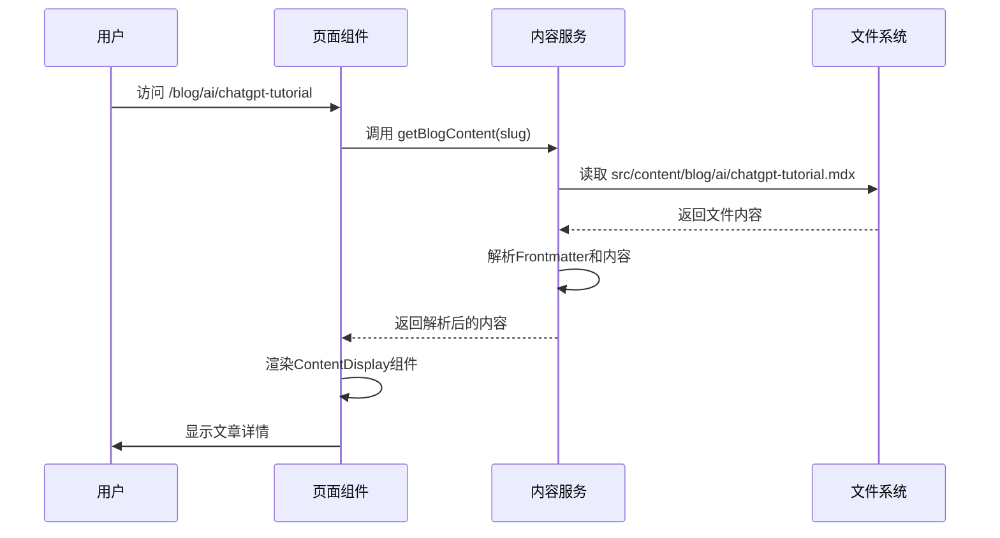

# 博客系统

博客系统是斐流艺创项目的核心功能之一，用于发布和管理技术文章、教程和创作分享。

## 功能特性

### 1. 文章管理

- 支持 Markdown 和 MDX 格式
- 文章草稿和发布功能
- 文章标签和分类管理
- 文章编辑历史记录

### 2. 内容展示

- 响应式文章页面设计
- 代码高亮显示
- 图片和媒体内容支持
- 文章目录自动生成

### 3. 导航和发现

- 按标签和分类浏览
- 时间线视图展示
- 相关文章推荐
- 最新文章列表

### 4. SEO优化

- 自动生成页面元数据
- 结构化数据标记
- 友好的 URL 设计
- sitemap 自动生成

## 技术实现

### 目录结构

博客系统的文件组织如下：

```
src/features/blog/
├── components/ - 博客相关UI组件
├── hooks/ - 自定义React钩子
├── lib/ - 业务逻辑库
├── types/ - TypeScript类型定义
└── index.ts - 模块导出入口

src/content/blog/ - 博客文章内容
├── ai/ - AI相关文章
├── frontend/ - 前端开发文章
├── backend/ - 后端开发文章
└── design/ - 设计相关文章
```

### 动态路由

博客系统使用 Next.js 的动态路由 `[...slug]` 来实现文章详情页的渲染。该机制允许通过 URL 路径动态加载对应的文章内容。

```typescript
interface BlogPostPageProps {
  params: Promise<{
    slug: string[];
  }>;
}
```

### 内容处理流程



### 核心组件

#### 博客卡片组件 (BlogCard)

用于在列表页展示文章摘要信息：

- 文章标题和描述
- 发布日期和标签
- 阅读时间估算
- 文章封面图片

#### 标签云组件 (TagCloudCard)

展示所有文章标签的可视化组件：

- 标签按使用频率大小显示
- 支持标签筛选功能
- 响应式设计适配

#### 最新文章组件 (LatestPostsCard)

展示最近发布的文章列表：

- 按发布时间排序
- 显示文章标题和日期
- 支持自定义显示数量

## API接口

博客系统提供以下API接口：

### 文章列表接口

```
GET /api/blog/posts
```

返回所有已发布的文章列表，支持分页和筛选。

### 标签接口

```
GET /api/blog/tags
```

返回所有文章标签及其使用统计。

### 时间线接口

```
GET /api/blog/timeline
```

按时间顺序返回文章列表，用于时间线展示。

## 数据结构

### 文章元数据

```typescript
interface BlogPost {
  slug: string;
  title: string;
  description: string;
  date: string;
  tags: string[];
  category?: string;
  coverImage?: string;
  readingTime?: number;
  featured?: boolean;
}
```

### 文章内容结构

```typescript
interface BlogPostContent extends BlogPost {
  content: string;
  tableOfContents: TableOfContentsItem[];
}
```

## 扩展功能

### 1. 评论系统集成

计划集成第三方评论系统，提供文章评论功能。

### 2. 文章订阅

实现RSS订阅功能，让用户可以订阅最新文章。

### 3. 内容推荐

基于用户阅读历史实现个性化内容推荐。

## 最佳实践

### 1. 内容创作

- 使用 Markdown 格式编写文章
- 合理使用标题层级（H1-H3）
- 添加适当的代码示例
- 配置文章元数据（标题、描述、标签等）

### 2. 性能优化

- 使用静态生成提高页面加载速度
- 实现增量静态再生（ISR）
- 优化图片资源加载
- 启用内容压缩

### 3. SEO优化

- 为每篇文章编写独特的描述
- 使用语义化的HTML标签
- 添加结构化数据标记
- 优化页面加载速度

博客系统通过这些功能和设计，为用户提供了优质的阅读体验，同时为内容创作者提供了便捷的发布和管理工具。