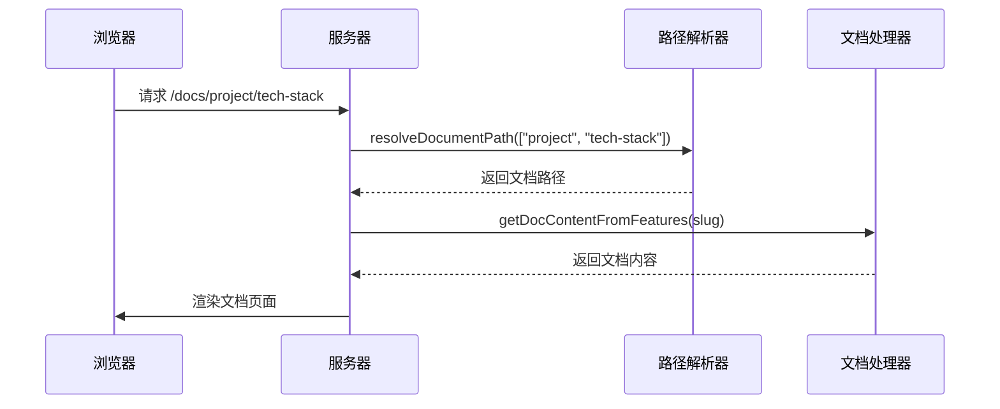
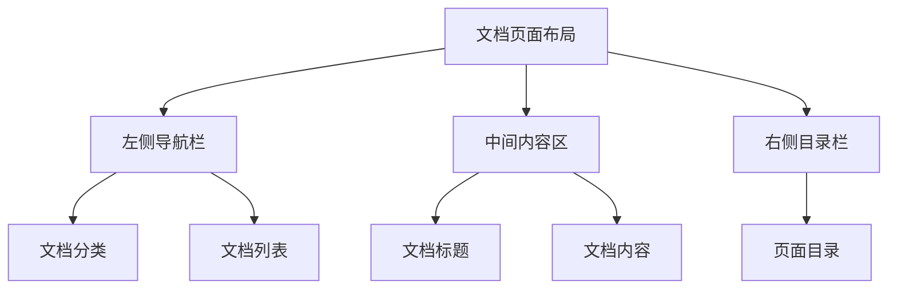

# 文档系统

文档系统是斐流艺创项目的重要组成部分，用于组织和展示技术文档、使用指南和知识库内容。

## 功能特性

### 1. 结构化内容管理

- 基于文件系统的文档组织
- 多级目录结构支持
- 元数据配置管理
- 文档版本控制

### 2. 导航和搜索

- 自动生成侧边栏导航
- 面包屑导航支持
- 页面内目录生成
- 全文搜索功能

### 3. 内容展示

- 响应式页面设计
- 代码高亮显示
- 数学公式支持
- 图表和流程图渲染

### 4. SEO优化

- 自动生成页面元数据
- 结构化数据标记
- 友好的 URL 设计
- sitemap 自动生成

## 技术实现

### 目录结构

文档系统的文件组织如下：

```
src/features/docs/
├── components/ - 文档相关UI组件
├── hooks/ - 自定义React钩子
├── lib/ - 业务逻辑库
├── types/ - TypeScript类型定义
└── index.ts - 模块导出入口

src/content/docs/ - 文档内容
├── _meta.json - 文档结构配置
├── getting-started/ - 快速开始指南
├── project/ - 项目介绍文档
├── features/ - 功能模块文档
└── development/ - 开发指南文档
```

### 元数据驱动导航

文档系统通过 `_meta.json` 配置文件实现层级导航结构的动态生成。该机制基于文件系统目录结构与元数据配置相结合的方式，构建完整的文档导航树。

主目录下的 `_meta.json` 定义了所有顶级分类：

```json
{
  "getting-started": {
    "title": "快速开始",
    "description": "从这里开始了解和使用斐流艺创项目"
  },
  "project": {
    "title": "项目介绍",
    "description": "斐流艺创的网站项目介绍"
  }
}
```

子目录中的 `_meta.json` 则定义了该分类下的具体文档条目：

```json
{
  "index": "项目概述",
  "project-info": "项目信息",
  "tech-stack": "技术栈"
}
```

### 动态路由处理

文档系统使用 Next.js 的动态路由 `[...slug]` 来处理任意深度的文档路径。该页面在服务端通过解析 MDX 文件，提取 frontmatter 元数据和内容，并生成目录结构。



### 响应式设计

文档系统采用三栏布局设计：

- 左侧：文档分类导航
- 中间：文档内容主体
- 右侧：当前页面目录



## 核心组件

### 文档侧边栏组件 (DocsSidebar)

提供文档分类导航功能：

- 自动根据 `_meta.json` 生成导航结构
- 支持展开/折叠分类
- 高亮当前页面所在分类
- 响应式设计适配

### 文档内容组件 (DocContent)

负责渲染文档内容：

- MDX 内容解析和渲染
- 代码块高亮显示
- 图片和媒体内容处理
- 目录结构生成

### 搜索组件 (DocSearch)

提供文档搜索功能：

- 实时搜索响应
- 搜索结果高亮
- 搜索历史记录
- 键盘快捷键支持

## API接口

文档系统提供以下API接口：

### 文档结构接口

```
GET /api/docs/global-structure
```

返回完整的文档结构信息，用于生成导航菜单。

### 文档内容接口

```
GET /api/docs/content?slug=...
```

根据slug参数返回指定文档的内容。

## 数据结构

### 文档元数据

```typescript
interface DocMetadata {
  title: string;
  description: string;
  date: string;
  update?: string;
  category?: string;
  tags?: string[];
}
```

### 文档结构

```typescript
interface DocStructure {
  slug: string[];
  title: string;
  description?: string;
  items?: DocStructure[];
}
```

## 扩展功能

### 1. 多语言支持

计划实现国际化支持，提供多语言文档版本。

### 2. 交互式示例

集成在线代码编辑器，提供交互式文档示例。

### 3. 内容贡献

实现文档编辑和贡献功能，支持社区参与。

## 最佳实践

### 1. 文档组织

- 使用清晰的目录结构组织文档
- 为每个目录创建 `_meta.json` 配置文件
- 合理划分文档分类和子分类
- 保持文档命名一致性

### 2. 内容编写

- 使用 Markdown 格式编写文档
- 合理使用标题层级（H1-H3）
- 添加适当的代码示例
- 配置文档元数据（标题、描述、标签等）

### 3. 导航设计

- 保持导航结构简洁明了
- 使用描述性的导航标签
- 合理控制导航层级深度
- 提供面包屑导航辅助

### 4. 性能优化

- 使用静态生成提高页面加载速度
- 实现增量静态再生（ISR）
- 优化图片资源加载
- 启用内容压缩

文档系统通过这些功能和设计，为用户提供了清晰、易用的技术文档浏览体验，同时为文档维护者提供了便捷的内容管理工具。