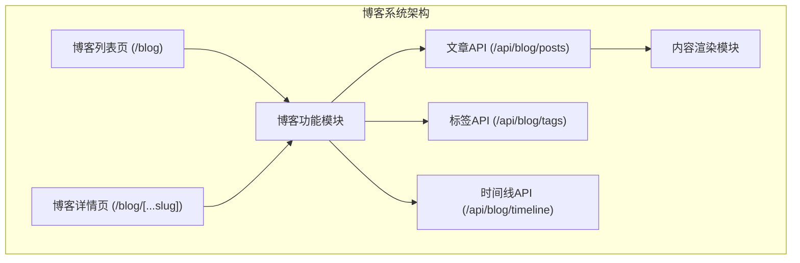
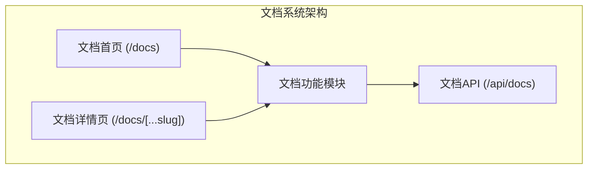
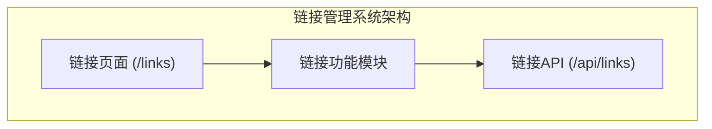
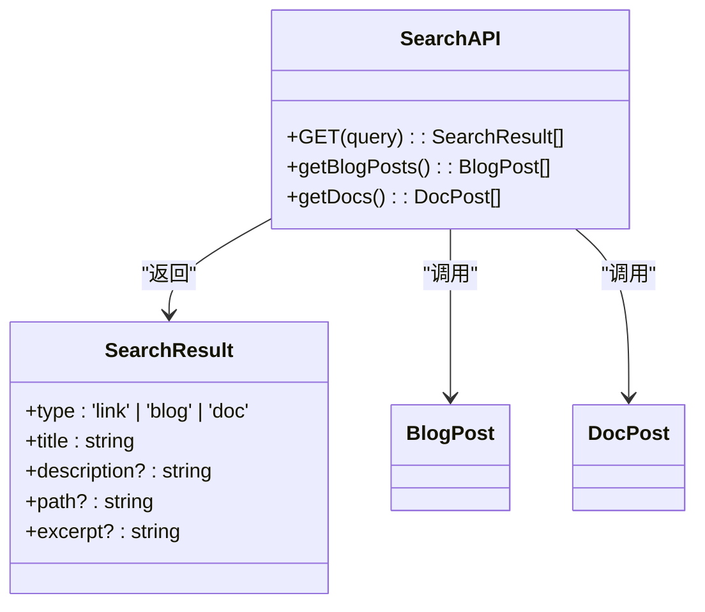
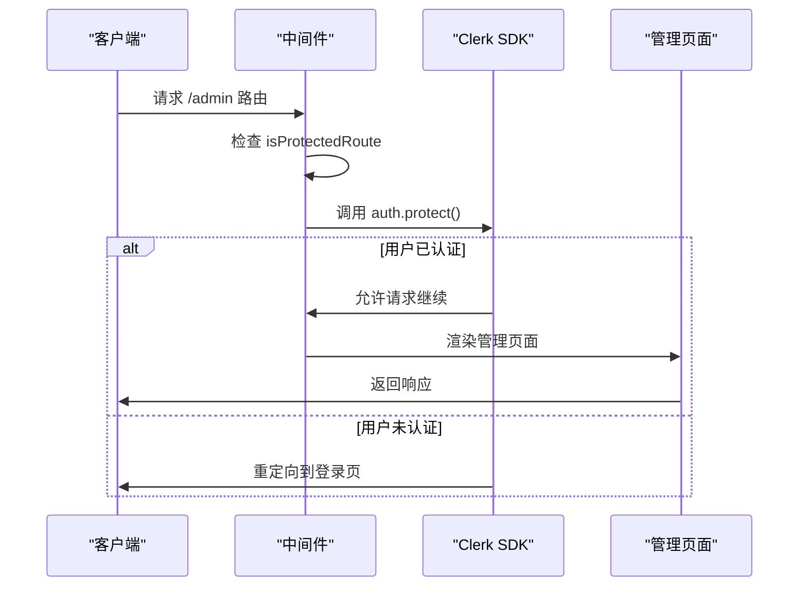
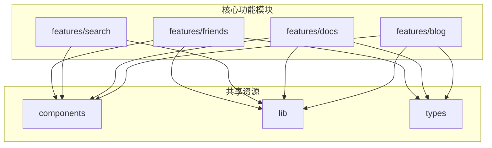

# 核心功能模块

斐流艺创项目包含多个核心功能模块，每个模块都经过精心设计，以提供最佳的用户体验和可维护性。

## 功能模块概览

项目采用功能驱动的目录结构，核心模块按功能划分，便于维护和扩展：

```
src/features/
├── admin/ - 管理后台功能
├── auth/ - 用户认证功能
├── blog/ - 博客系统
├── code/ - 代码演示功能
├── comment/ - 评论系统
├── content-display/ - 内容展示功能
├── docs/ - 文档系统
├── friends/ - 友情链接功能
├── home/ - 首页功能
├── links/ - 链接管理功能
└── search/ - 全局搜索功能
```

每个功能模块都包含自己的组件、钩子、类型和业务逻辑，实现了功能的完全封装。

## 1. 博客系统

博客系统是项目的核心功能之一，用于发布和管理技术文章。

### 主要特性

- 文章发布和管理
- 标签和分类系统
- 时间线展示
- 相关文章推荐
- 响应式设计

### 技术实现

博客系统使用 Next.js 的动态路由 `[...slug]` 来实现文章详情页的渲染。内容存储在 `src/content/blog` 目录下的 MDX 文件中，通过 API 路由暴露为 JSON 接口。



## 2. 文档系统

文档系统提供结构化的文档组织和展示功能。

### 主要特性

- 多级目录导航
- 响应式设计
- 全文搜索
- 代码高亮
- SEO优化

### 技术实现

文档系统通过 `_meta.json` 配置文件实现层级导航结构的动态生成。该机制基于文件系统目录结构与元数据配置相结合的方式，构建完整的文档导航树。



## 3. 链接管理系统

链接管理系统提供分类化的书签收藏功能。

### 主要特性

- 分类书签管理
- 友情链接展示
- 个人资料页面
- 社交链接聚合

### 技术实现

链接管理模块采用基于目录的分类体系，每个分类对应一个 JSON 文件或子目录。



## 4. 全局搜索功能

全局搜索功能实现跨模块内容搜索。

### 主要特性

- 跨模块内容搜索
- 实时搜索响应
- 搜索结果高亮
- 多源数据整合

### 技术实现

全局搜索功能通过多个 API 端点整合不同模块的数据。



## 5. 用户认证系统

用户认证系统提供完整的用户认证和授权功能。

### 主要特性

- 用户注册和登录
- 第三方认证集成
- 个人资料管理
- 管理后台访问控制

### 技术实现

项目集成 Clerk 实现完整的用户认证系统，通过中间件实现路由级别的访问控制。



## 6. 管理后台

管理后台提供内容管理和系统配置功能。

### 主要特性

- 内容管理界面
- 用户和权限管理
- 系统配置
- 数据统计和分析

## 7. 代码演示系统

代码演示系统用于展示和运行代码示例。

### 主要特性

- 在线代码编辑器
- 实时代码预览
- 多语言支持
- 代码分享功能

## 模块间依赖关系

各功能模块之间通过清晰的接口进行通信，形成了一个高内聚、低耦合的系统架构。



## 扩展性设计

每个功能模块都遵循以下设计原则：

1. **单一职责** - 每个模块只负责一个核心功能
2. **可插拔性** - 模块可以独立开发和测试
3. **接口标准化** - 模块间通过标准化接口通信
4. **配置驱动** - 通过配置文件控制模块行为

这种设计使得项目具有良好的扩展性，可以方便地添加新功能模块或修改现有模块。