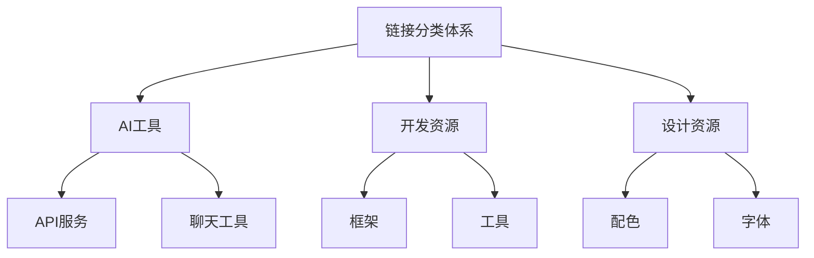

# 链接管理系统

链接管理系统是斐流艺创项目的特色功能之一，用于管理和展示分类化的书签链接、友情链接和个人社交资料。

## 功能特性

### 1. 分类管理

- 支持多级分类体系
- 自定义分类图标和描述
- 分类排序和折叠功能
- 分类统计信息显示

### 2. 链接管理

- 链接标题、URL和描述
- 标签系统支持
- 推荐链接标识
- 链接有效性检查

### 3. 展示功能

- 响应式卡片布局
- 分类筛选和搜索
- 社交链接聚合展示
- 个人资料页面集成

### 4. 数据管理

- JSON格式数据存储
- 数据导入导出功能
- 批量操作支持
- 数据备份和恢复

## 技术实现

### 目录结构

链接管理系统的文件组织如下：

```
src/features/links/
├── components/ - 链接相关UI组件
├── hooks/ - 自定义React钩子
├── lib/ - 业务逻辑库
├── types/ - TypeScript类型定义
└── index.ts - 模块导出入口

src/content/links/ - 链接数据
├── category/ - 分类配置
├── friends.json - 友情链接数据
└── profile.json - 个人资料数据
```

### 数据结构设计

链接管理系统采用基于JSON文件的数据存储方案，具有以下优势：

1. **简单易用** - 无需数据库配置
2. **版本控制** - 数据变更可追踪
3. **易于维护** - 直接编辑JSON文件
4. **性能优秀** - 静态数据加载快速

### 分类体系

链接管理模块采用基于目录的分类体系，每个分类可以包含子分类和链接项。



### 核心数据结构

#### 链接分类

```typescript
interface LinksCategory {
  id: string;
  name: string;
  description?: string;
  icon?: string;
  order?: number;
  collapsible?: boolean;
  children?: LinksSubCategory[];
}
```

#### 链接项

```typescript
interface LinksItem {
  title: string;
  url: string;
  description?: string;
  category: string;
  tags?: string[];
  featured?: boolean;
  id: string;
}
```

## 核心组件

### 链接卡片组件 (LinkCard)

用于展示单个链接项：

- 链接标题和描述
- 访问链接按钮
- 标签显示
- 推荐标识

### 数据表格组件 (LinksTable)

用于管理链接数据：

- 表格形式展示链接列表
- 支持排序和筛选
- 批量操作功能
- 分页支持

### 侧边栏导航组件 (LinksSidebar)

提供分类导航功能：

- 分类树形结构展示
- 分类展开/折叠
- 当前分类高亮
- 响应式设计

### 链接表单组件 (LinkForm)

用于添加和编辑链接：

- 表单验证
- 数据预填充
- 提交状态管理
- 错误处理

## API接口

链接管理系统提供以下API接口：

### 获取所有链接

```
GET /api/links
```

返回所有链接数据，支持筛选和分页。

### 获取所有链接分类

```
GET /api/links/categories
```

返回所有链接分类信息。

### 按分类获取链接列表

```
GET /api/links/category/:categoryId
```

根据分类ID返回该分类下的所有链接。

## 扩展功能

### 1. 链接有效性检查

计划实现自动化的链接有效性检查功能：

- 定期检查链接可用性
- 标记失效链接
- 发送通知提醒

### 2. 数据导入导出

支持多种格式的数据导入导出：

- JSON格式导入导出
- CSV格式支持
- Markdown格式导出

### 3. 统计分析

提供链接访问统计功能：

- 点击量统计
- 访问来源分析
- 热门链接排行

## 最佳实践

### 1. 数据组织

- 合理规划分类结构
- 为每个链接添加描述信息
- 使用标签进行细粒度分类
- 定期清理无效链接

### 2. 用户体验

- 提供搜索和筛选功能
- 使用直观的卡片布局
- 支持键盘导航
- 优化移动端显示效果

### 3. 性能优化

- 使用静态数据减少请求
- 实现数据缓存机制
- 优化图片和图标加载
- 启用内容压缩

### 4. 可维护性

- 保持数据结构一致性
- 添加必要的注释说明
- 定期备份重要数据
- 使用版本控制管理变更

链接管理系统通过这些功能和设计，为用户提供了便捷的链接管理和展示功能，同时为维护者提供了简单易用的数据管理工具。