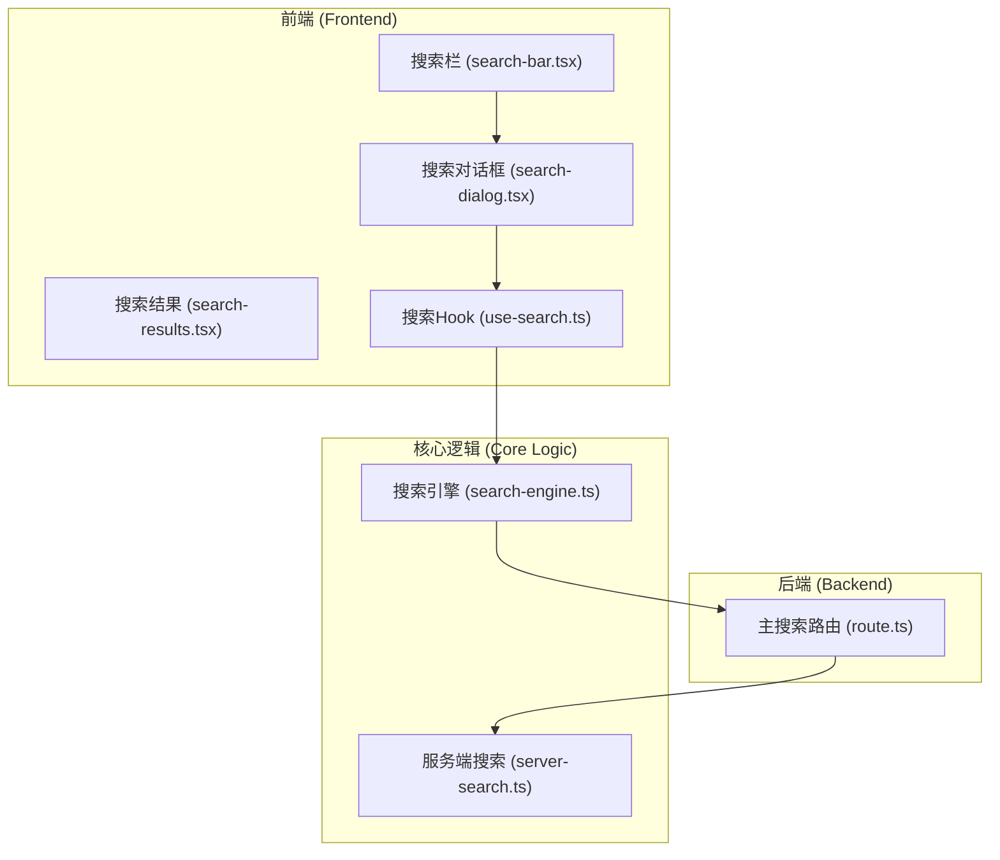
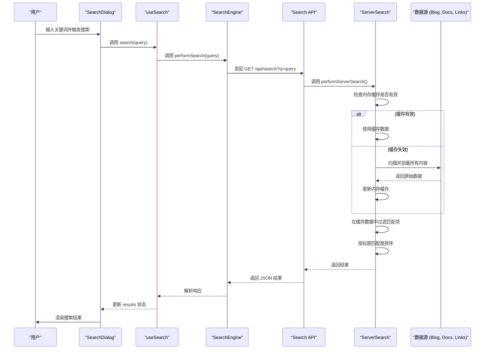

# 全局搜索功能

全局搜索功能是斐流艺创项目的重要特性之一，允许用户跨模块搜索内容，快速找到所需信息。

## 功能特性

### 1. 多源数据搜索

- 跨博客、文档、链接模块搜索
- 统一搜索结果展示
- 按内容类型分类显示
- 相关性排序

### 2. 实时搜索

- 输入即时响应
- 防抖优化避免频繁请求
- 加载状态提示
- 搜索历史记录

### 3. 搜索体验

- 搜索结果高亮显示
- 关键词匹配度排序
- 结果摘要展示
- 响应式设计适配

### 4. 性能优化

- 内存缓存机制
- 增量数据更新
- 结果数量限制
- 异步加载处理

## 技术实现

### 系统架构

全局搜索功能采用前后端分离的架构设计：



### 核心组件

#### 搜索对话框 (SearchDialog)

提供完整的搜索交互界面：

- 模态对话框设计
- 搜索输入框
- 搜索结果展示区域
- 加载状态和错误处理

#### 搜索Hook (useSearch)

封装搜索状态和逻辑：

- 搜索关键词管理
- 防抖处理
- 结果状态管理
- 错误处理

#### 搜索引擎 (SearchEngine)

处理搜索请求的核心逻辑：

- API请求封装
- 结果解析处理
- 错误处理机制

### 数据流设计



### 性能优化策略

1. **内存缓存**：后端API使用内存缓存存储扫描到的数据，避免每次搜索都重新扫描文件系统
2. **客户端防抖**：前端通过防抖定时器避免用户在输入时频繁触发搜索请求
3. **结果限制**：后端对每个数据源的结果进行限制，控制数据传输量
4. **异步加载**：所有文件读取和网络请求均使用异步处理，保证UI流畅性

## API接口

### 主搜索接口

```
GET /api/search?q={query}
```

参数：
- `q` - 搜索关键词

返回：
- 搜索结果列表，包含博客、文档、链接等不同类型的内容

### 博客搜索接口

```
GET /api/search/blog?q={query}
```

专门搜索博客内容。

### 文档搜索接口

```
GET /api/search/docs?q={query}
```

专门搜索文档内容。

### 链接搜索接口

```
GET /api/search/links?q={query}
```

专门搜索链接内容。

## 数据结构

### 搜索结果

```typescript
interface SearchResult {
  type: 'link' | 'blog' | 'doc';
  title: string;
  description?: string;
  path?: string;
  excerpt?: string;
  date?: string;
}
```

### 搜索响应

```typescript
interface SearchResponse {
  results: SearchResult[];
  total: number;
  took: number; // 搜索耗时
}
```

## 扩展功能

### 1. 搜索建议

计划实现搜索建议功能：

- 根据输入提供关键词建议
- 热门搜索词推荐
- 搜索历史记录

### 2. 高级搜索

支持更复杂的搜索语法：

- 布尔搜索操作符
- 字段限定搜索
- 日期范围筛选

### 3. 全文搜索

集成专业的全文搜索引擎：

- 支持模糊匹配
- 提高搜索准确度
- 支持同义词搜索

## 最佳实践

### 1. 用户体验

- 提供清晰的搜索入口
- 实现快速的搜索响应
- 展示相关的搜索结果
- 支持键盘快捷操作

### 2. 性能优化

- 合理设置缓存策略
- 限制搜索结果数量
- 使用防抖避免频繁请求
- 异步处理搜索任务

### 3. 结果展示

- 按内容类型分类展示
- 高亮匹配的关键词
- 提供结果摘要信息
- 支持分页加载更多

### 4. 可维护性

- 保持搜索逻辑独立
- 使用类型安全的数据结构
- 添加充分的错误处理
- 记录搜索性能指标

全局搜索功能通过这些设计和实现，为用户提供了快速、准确的内容发现体验，同时保证了系统的性能和可维护性。