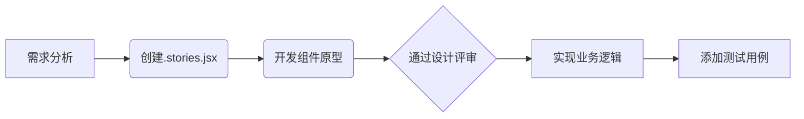

本站所用的 UI 组件可分为以下三种：

### UI 组件 (`components/ui/`)

#### 开发规范
1. **原子化设计**：
   - 遵循Atomic Design原则
   - 使用Storybook进行可视化开发
   ```jsx
   // Button.stories.jsx
   export const Primary = {
     args: {
       variant: 'primary',
       children: 'Submit'
     }
   }
   ```
2. **版本管理**：
   - 采用语义化版本控制
   - 重大变更通过`legacy`目录维护旧版本

#### 准入标准
- 通过100%单元测试覆盖率
- 提供完整的TypeScript类型定义
- 包含交互状态样式（hover/focus/disabled）

### 功能组件 (`components/features/`)

#### 开发流程


#### 版本控制
- 使用Git子模块管理跨项目组件
- 通过CHANGELOG.md记录变更历史
- 重大更新提供迁移指南

### 布局组件 (`components/layout/`)

布局组件定义页面的结构和排列：

- **定义页面结构**：提供一致的布局
- **管理空间分配**：处理元素的排列和间距
- **响应式设计**：适应不同屏幕尺寸

例如：Navbar, Footer, PageLayout 等。

## 网址导航改进建议

后续改进建议
虽然我们已经完成了基本的模块化重构，但还有一些可以进一步改进的地方：

添加单元测试：为组件和钩子函数添加单元测试，确保代码质量
添加搜索功能：实现资源搜索功能，提高用户体验
添加排序功能：实现资源排序功能，方便用户查找
添加收藏功能：实现资源收藏功能，方便用户保存感兴趣的资源
添加分页功能：当资源数量较多时，实现分页功能，提高性能

## 博客改进建议

添加单元测试：为组件和钩子函数添加单元测试，确保代码质量
添加分页功能：实现博客列表分页功能，提高性能
添加搜索功能：实现博客搜索功能，提高用户体验
添加评论功能：实现博客评论功能，增强用户互动
添加社交分享功能：实现社交分享功能，提高文章传播

## 文档改进建议

添加单元测试：为组件和钩子函数添加单元测试，确保代码质量
添加搜索功能：实现文档搜索功能，提高用户体验
添加版本控制：实现文档版本控制功能，支持查看历史版本
添加评论功能：实现文档评论功能，增强用户互动
添加编辑功能：实现在线编辑功能，方便用户贡献内容