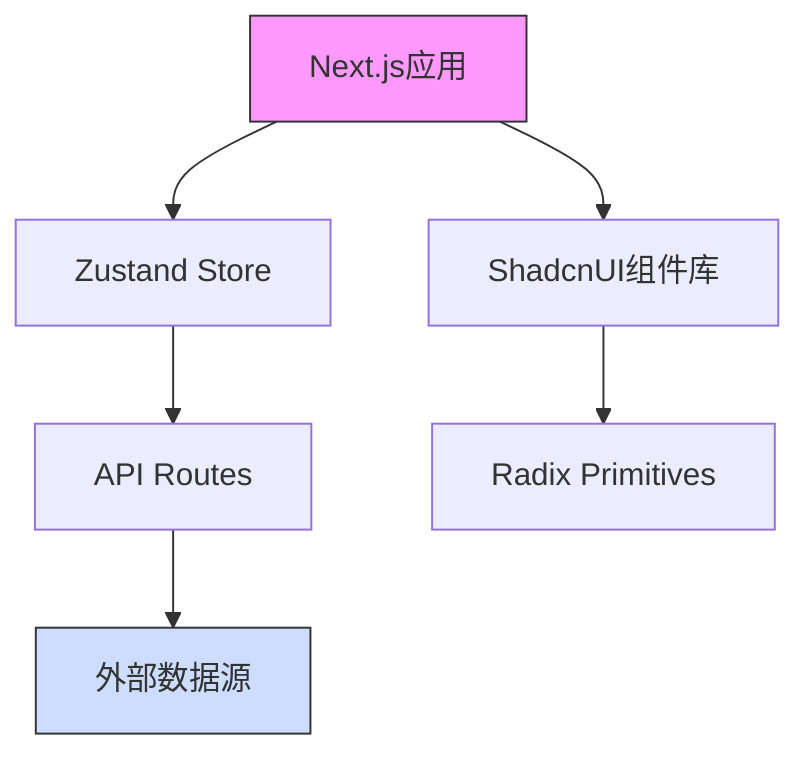

# 代码块测试

本页面用于测试不同类型的代码块渲染效果。

## 普通代码块

```javascript
// 这是一个 JavaScript 代码块
function hello() {
  console.log("Hello, World!");
  return "Hello, World!";
}

// 调用函数
hello();
```

## 带行号的代码块

```typescript
// 这是一个 TypeScript 代码块
interface User {
  id: number;
  name: string;
  email: string;
}

class UserService {
  private users: User[] = [];

  constructor() {
    console.log("UserService initialized");
  }

  getUsers(): User[] {
    return this.users;
  }

  addUser(user: User): void {
    this.users.push(user);
  }
}
```

## 流程图



## 另一个流程图示例


## 系统架构图


