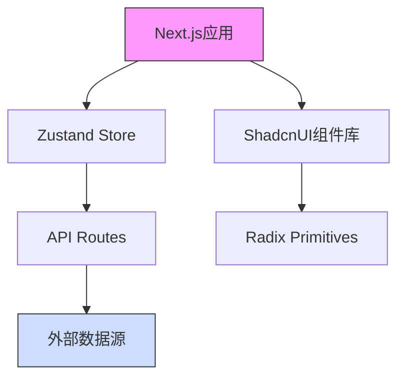

# 样式测试

这个页面用于测试代码块和行内代码的样式。

## JavaScript 代码块

```javascript
// 这是一个 JavaScript 函数
function hello() {
  console.log("Hello, World!");
  return "Hello, World!";
}

// 调用函数
hello();
```

## TypeScript 代码块

```typescript
// 这是一个 TypeScript 接口
interface User {
  id: number;
  name: string;
  email: string;
}

// 这是一个 TypeScript 类
class UserService {
  private users: User[] = [];

  constructor() {
    console.log("UserService initialized");
  }

  getUsers(): User[] {
    return this.users;
  }

  addUser(user: User): void {
    this.users.push(user);
  }
}
```

## CSS 代码块

```css
.container {
  max-width: 1200px;
  margin: 0 auto;
  padding: 1rem;
}

.button {
  background-color: #3490dc;
  color: white;
  padding: 0.5rem 1rem;
  border-radius: 0.25rem;
  transition: background-color 0.3s;
}

.button:hover {
  background-color: #2779bd;
}
```

## 行内代码

这是一个基本的行内代码示例：`const x = 42;`

组件路径示例：`components/ui/`

特殊字符示例：`function test() { return true; }`

这是一个包含反引号的示例：`` `code` ``

## 流程图


